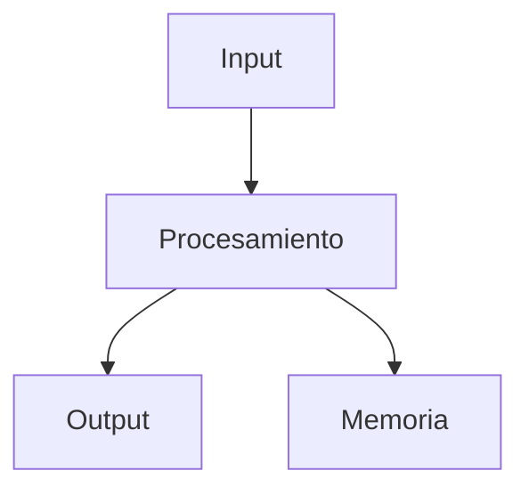

---
aliases:
  - Anatomía de la Prog
  - Estructura de Programas
  - Partes de un Programa
  - Fundamentos de un Programa
tags:
  - fundamentos
  - entrada-proceso-salida
created: 2026-02-19 13:51
modified: 2026-02-19 13:51
rating: 5
nivel: 3
fuentes:
  - Libro base de la programación estructurada
  - Documentación oficial del Lenguaje
estado: dominado
---
# 🧠 Anatomía de la Programación

> [!abstract]+ Resumen Ejecutivo (Nivel 1)
> Todo programa es una combinación de datos + instrucciones + flujo de ejecución.
> Entender su anatomía permite leer, diseñar y depurar cualquier lenguaje con mayor claridad.

## 🎯 **Concepto Clave**
**Definición**: La anatomía de la programación describe las partes fundamentales que componen cualquier programa: entrada, procesamiento, la almacenamiento, salida y control del flujo.

En esencia, programar es dar instrucciones precisas a una máquina que solo entiende estados y transformaciones.

##### **Fórmula/Key Metric**:
No hay fórmula matemática única pero todo programa puede representarse cómo:
`Input → Proceso → Output`

##### **Ejemplo Práctico**:
```js
function sumar(a, b) {
  return a + b;
}

console.log(sumar(2, 3));
```

- Input → 2 y 3
- Proceso → Suma
- Output → 5
## 🔍 **Mapa del Concepto**


## 📋 **Propiedades Clave**
| Aspecto       | Detalle                                                      |
| ------------- | ------------------------------------------------------------ |
| Complejidad   | baja                                                         |
| Uso frecuente | Esencial                                                     |
| **Big-O**     | depende del algoritmo interno                                |
| Prerequisitos | [[08. Pensamiento Algorítmico]], [[09. Modelos de Ejecución]] |

## ⚠️ Errores Comunes
- Pensar que programar es "escribir código bonito" y no pensar en lógica u optimización.
- Ignorar el flujo de ejecución y asumir que todo ocurre simultáneamente.
- Confundir datos con instrucciones.
- No considerar cómo y dónde se almacenan los valores

## 💡 Intuición
Un programa es como una receta de cocina estricta.

No improvisa. No interpreta. No asume.
Si falta un paso, falla. Si el orden es incorrecto, el resultado cambia.

## 🔗 **Conexiones**
- Entrada: [[08. Pensamiento Algorítmico|Pensamiento Algorítmico]] → Esta nota
- Salida: Esta nota → [[09. Modelos de Ejecución|Modelo de Ejecución]]
- Hermanos: [[03. Variables y Tipos de Datos|Variables y Tipos de Datos]], [[05. Estructuras de Control|Estructuras de Control]]

## 🧩 Pregunta típica de entrevista
- ¿Qué ocurre realmente cuando ejecutas un programa?
- ¿Cuál es la diferencia entre lógica de negocio y flujo de control?
- ¿Cómo se transforma la entrada en salida a nivel conceptual?

## 📝 **Ejercicio Activo**
- Toma un programa simple (calculadora básica) y separa claramente:
	1. Input
	2. Proceso
	3. Output
- Identifica dónde interviene la memoria.
- [ ] Explícalo en 1 minuto sin usar la palabra “código”.
## 🚀 **Siguiente Acción**
- **Leer**: [[09. Modelos de Ejecución|Modelo de Ejecución]]
- **Hacer**: Dibujar el Flujo Real de un Programa que hayas escrito.

## 📚 **Fuentes**
1. [Wikipedia: Programación estructurada](https://es.wikipedia.org/wiki/Programaci%C3%B3n_estructurada)
2. [PDF UTN: Programación Estructurada](http://www1.frm.utn.edu.ar/informatica1/VIANI/PROGRAMACION%20ESTRUCTURADA/PROGRAMACION%20ESTRUCTURADA.PDF)
3. [Fundamentos de Programación - Joyanes](https://elhacker.info/manuales/Lenguajes%20de%20Programacion/Fundamentos_de_programaci%C3%B3n_4ta_Edici%C3%B3n_Luis_Joyanes_Aguilar.pdf)
