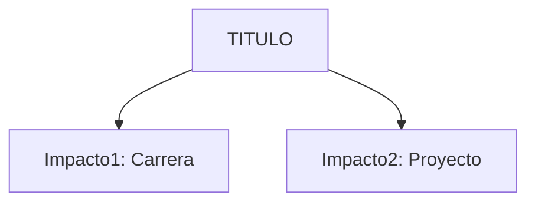
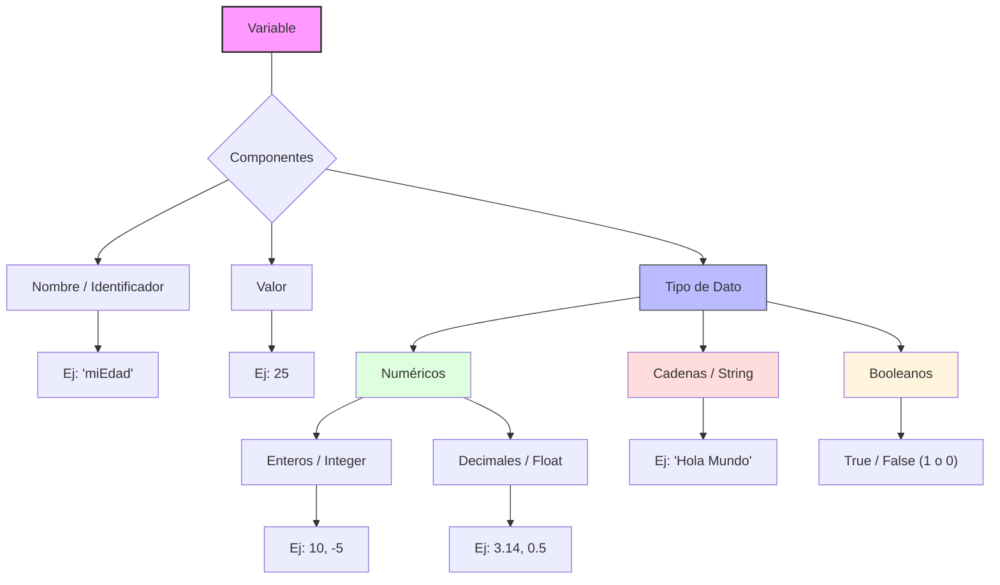

> [!info] Para Borrar después:
> **aliases:** Búsquedas alternativas
> **tags:** Filtros Dataview/Gráficos
> **created/modified:** Historial de cambios
> **rating:** Prioridad personal (1-5 ⭐)
> 	1. Curiosidad / Contexto
> 	2. Útil pero no crítico
> 	3. Importante
> 	4. Muy importante
> 	5. Fundamento absoluto
>**nivel:** 1=Crudo, 2=Explicado bien, 3=Profundizado
>**fuentes:** Referencias
>estado: no terminado/pendiente/estudiando/dominado

> [!info] Para Borrar después:
> **aliases:** Búsquedas alternativas
> **tags:** Filtros Dataview/Gráficos
> **created/modified:** Historial de cambios
> **rating:** Prioridad personal (1-5 ⭐)
> 	1. Curiosidad / Contexto
> 	2. Útil pero no crítico
> 	3. Importante
> 	4. Muy importante
> 	5. Fundamento absoluto
>**nivel:** 1=Crudo, 2=Explicado bien, 3=Profundizado
>**fuentes:** Referencias
>estado: no terminado/pendiente/estudiando/dominado
<%*
let title = tp.file.title;
if (title.startsWith("Untitled")) {
    title = await tp.system.prompt("Título de la nota");
    await tp.file.rename(`${title}`);
}
%>
# <% title %>

> [!abstract]+ Resumen
> **Idea Principal**:
> **Contexto**: ¿Por qué es importante para un ING. Software?

## 🎯 **Concepto Clave**
**Definición**: 

> [!tip] Intuición (Explicación para un niño)
> 

##### 💻 **Implementación / Ejemplo**
<%* if (tp.file.folder().includes("JavaScript")) { %>
```js
// Ejemplo de JS
```
<%* } else if (tp.file.folder().includes("Python")) { %>
```python
# Ejemplo de Python
```
<%* } else { %>
```txt
// Ejemplo genérico
```
<%* } %>

##### **Fórmula/Key Metric** (si aplica): `Nombre de la Fórmula`
```

Formula
```

## 🔍 **¿Por qué importa?**


## 📋 **Propiedades Clave**
| Aspecto       | Detalle              |
| ------------- | -------------------- |
| Complejidad   | baja/media/alta      |
| Uso frecuente | rara/común/esencial  |
| Complejidad (Big-O)| O(?)                 |
| Prerequisitos | [[nota1]], [[nota2]] |
| MOC Padre     | [[<% tp.file.folder() %>_MOC |

## ⚠️ Errores Comunes
- Confundir X con Y
- Olvidar caso límite Z

## 💡 Intuición
Cómo explicaría esto sin jerga técnica.

## 🔗 **Conexiones**
- **Entrada**: [[concepto_previo]] → Esta nota
- **Salida**: Esta nota → [[concepto_siguiente]]
- **Hermanos**: [[concepto_similar]]

## 🧩 Pregunta típica de entrevista
- ¿Cómo optimizarías esto?

## ​🛠 Laboratorio (Active Recall)
​[ ] Explicación Feynman: ¿Puedo explicarlo sin trabarme?
​[ ] Flashcard: (Opcional: crear pregunta para Anki)
​[ ] Prueba de Código: Implementado en [[Laboratorio]]

## 🚀 **Siguiente Acción**
- **Leer**: Libro/PDF página X
- **Hacer**: Ejercicio Y

## 📚 **Fuentes**
1. [Libro/PDF]()

<%*
let title = tp.file.title;
if (title.startsWith("Untitled")) {
    title = await tp.system.prompt("Título de la nota");
    await tp.file.rename(`${title}`);
}%>
# <% title %>

> [!abstract]+ Resumen
> **Idea Principal**:
> **Contexto**: ¿Por qué es importante para un ING. Software?

## 🎯 **Concepto Clave**
**Definición**: 

> [!tip] Intuición (Explicación para un niño)
> 

##### 💻 **Implementación / Ejemplo**
<%* if (tp.file.folder().includes("JavaScript")) { %>
```js
// Ejemplo de JS
```
<%* } else if (tp.file.folder().includes("Python")) { %>
```python
# Ejemplo de Python
```
<%* } else { %>
```txt
// Ejemplo genérico
```
<%* } %>

##### **Fórmula/Key Metric** (si aplica): `Nombre de la Fórmula`
```

Formula
```

## 🔍 **¿Por qué importa?**


## 📋 **Propiedades Clave**
| Aspecto       | Detalle              |
| ------------- | -------------------- |
| Complejidad   | baja/media/alta      |
| Uso frecuente | rara/común/esencial  |
| Complejidad (Big-O)| O(?)                 |
| Prerequisitos | [[nota1]], [[nota2]] |
| MOC Padre     | [[<% tp.file.folder() %>_MOC |

## ⚠️ Errores Comunes
- Confundir X con Y
- Olvidar caso límite Z

## 💡 Intuición
Cómo explicaría esto sin jerga técnica.

## 🔗 **Conexiones**
- **Entrada**: [[concepto_previo]] → Esta nota
- **Salida**: Esta nota → [[concepto_siguiente]]
- **Hermanos**: [[concepto_similar]]

## 🧩 Pregunta típica de entrevista
- ¿Cómo optimizarías esto?

## ​🛠 Laboratorio (Active Recall)
​[ ] Explicación Feynman: ¿Puedo explicarlo sin trabarme?
​[ ] Flashcard: (Opcional: crear pregunta para Anki)
​[ ] Prueba de Código: Implementado en [[Laboratorio]]

## 🚀 **Siguiente Acción**
- **Leer**: Libro/PDF página X
- **Hacer**: Ejercicio Y

## 📚 **Fuentes**
1. [Libro/PDF]()

---
aliases:
  - Variables
  - Tipos Primitivos
  - Data Types
tags:
  - fundamentos
  - datos
created: 2026-02-19 22:18
modified: 2026-02-19 22:18
rating: 5 ⭐
nivel: 1
fuentes:
  - MDN
  - Python
  - FreeCodeCamp
estado:
  - dominado
---
# Variables y Tipos de Datos

> [!abstract]+
> Las variables permiten almacenar información en Memoria.
> 
> Los tipos de datos determinan qué clase de información se guarda y cómo se comportan.

## 🎯 **Concepto Clave**
**Definición**: Una Memoria es un espacio en Memoria identificado por un nombre que almacena el valor.

Un Tipo de datos define:
- Qué clase de valor se puede guardar
- Qué operaciones se pueden realizar con él
- Cuánta memoria ocupa (dependiendo del lenguaje)

##### **Ejemplo Práctico**:
```js
// Tipos de variables
var identificación
let identificación
const identificación

// Tipos de datos
let nombre = "David" // string
let edad = 17 // number-int
let altura = 1.72 // float
let vivo = true // booleana

// Otros Tipos de datos
let Nulo = null // null
let NoDefinido = undefined // undefined
let BigInt1 = BigInt("1837187381278263817281728272728273828") // BigInt
let BigInt2 = BigInt(817281639173927391783728371937927382819) // BigInt
let HugeInt1 = 1288272916391739263916391739279371973297328738n // BigInt (...n)
let MySymbol = Symbol("ID")
```

## 🔍 **Mapa del Concepto**


## 📋 **Propiedades Clave**
| Aspecto       | Detalle              |
| ------------- | -------------------- |
| Complejidad   | baja                 |
| Uso frecuente | esencial             |
| **Big-O**     | No aplica            |
| Prerequisitos | [[01. Anatomia de la Programación]] |

## ⚠️ Errores Comunes
- Pensar que la variable es el valor.
- Asumir que siempre tienen que tener un valor las variables.
- No entender la diferencia entre asignación y comparación.
- Creer que todos los tipos se comportan igual en memoria.

## 💡 Intuición
Normalmente se vé las variables como "cajas negras" pero, así como en matemáticas simplemente es un nombre que se le asigna a un valor, es... Como decirlo, una etiqueta a una maleta que está almacenada en Memoria.

El tipo de dato es la regla que dice qué puede vivir en ese espacio.

Si la Memoria fuera un edificio:
- La variable es el número del apartamento.
- El tipo es el contrato que define que puede guardarse allí.

## 🔗 **Conexiones**
- **Entrada**: [[01. Anatomia de la Programación|Anatomía de la Programación]]
- **Salida**: [[04. Operadores y Expresiones|Operadores y Expresiones]]
- **Hermanos**: [[09. Modelos de Ejecución|Modelos de Ejecución]]

## 🧩 Pregunta típica de entrevista
- ¿Qué diferencia hay entre variable y valor?
- ¿Por qué los tipos de datos son importantes?
- ¿Qué ocurre si guardas un valor distinto al tipo esperado?

## 📝 **Ejercicio Activo**
- [x] Declara una variable de cada tipo básico en tú lenguaje principal
- [x] Intenta cambiar el tipo de una variable y observa que ocurre
- [ ] Explica la diferencia entre tipo primitivo y objeto

## 🚀 **Siguiente Acción**
- **Leer**: [[04. Operadores y Expresiones|Operadores y Expresiones]]
- Revisar como el lenguaje que usas maneja tipos internamente.

## 📚 **Fuentes**
1. [Fundamentos de Programación - Luis Joyanes Aguilar](https://elhacker.info/manuales/Lenguajes%20de%20Programacion/Fundamentos_de_programaci%C3%B3n_4ta_Edici%C3%B3n_Luis_Joyanes_Aguilar.pdf)

**Referencia Oficial** (tipos por lenguaje):
2. [MDN: Tipos de Datos Primitivos](https://developer.mozilla.org/es/docs/Glossary/Primitive)
3. [Python.org: Tipos Built-in](https://docs.python.org/es/3/library/stdtypes.html)

**Visual Interactivo**:
2. [Tipos Primitivos - freeCodeCamp](https://www.freecodecamp.org/espanol/news/tipos-de-datos-en-javascript/)

