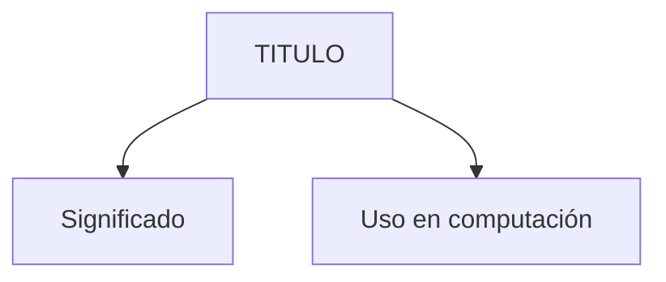
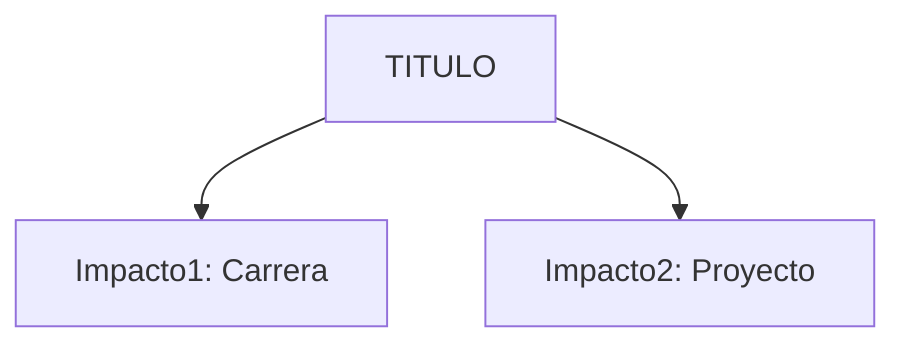

> [!info] Para Borrar después:
> **aliases:** Búsquedas alternativas
> **tags:** Filtros Dataview/Gráficos
> **created/modified:** Historial de cambios
> **rating:** Prioridad personal (1-5 ⭐)
> 	1. Curiosidad / Contexto
> 	2. Útil pero no crítico
> 	3. Importante
> 	4. Muy importante
> 	5. Fundamento absoluto
>**nivel:** 1=Crudo, 2=Explicado bien, 3=Profundizado
>**fuentes:** Referencias
>estado: no terminado/pendiente/estudiando/dominado


# 03. Variables y Tipos de Datos

> [!abstract]+ Resumen
> **Idea Principal**:
> **Contexto**: ¿Por qué es importante para un ING. Software?

## 🎯 **Concepto Clave**
**Definición**: Explica de forma detallada qué es.

> [!tip] Intuición:
> (Explicación para un niño)

##### 💻 **Implementación / Ejemplo**

```markdown
##### Ejemplo genérico
```


##### **Fórmula/Key Metric** (si aplica): `Nombre de la Fórmula`
```

Formula
```

## 🔍 **Mapa del Concepto**


## 🔍 **¿Por qué importa?**


## 📋 **Propiedades Clave**
| Aspecto       | Detalle              |
| ------------- | -------------------- |
| Complejidad   | baja/media/alta      |
| Uso frecuente | rara/común/esencial  |
| Complejidad (Big-O)| O(?)                 |
| Prerequisitos | [[nota1]], [[nota2]] |
| MOC Padre     | [[00_FUNDAMENTOS_MOC]] |

## ⚠️ Errores Comunes
- Confundir X con Y
- Olvidar caso límite Z

## 💡 Intuición
Cómo explicaría esto sin jerga técnica.

## 🔗 **Conexiones**
- **Entrada**: [[concepto_previo]] → Esta nota
- **Salida**: Esta nota → [[concepto_siguiente]]
- **Hermanos**: [[concepto_similar]]

## 🧩 Pregunta típica de entrevista
- ¿Cómo optimizarías esto?

## ​🛠 Laboratorio (Active Recall)
​[ ] Explicación Feynman: ¿Puedo explicarlo sin trabarme?
​[ ] Flashcard: (Opcional: crear pregunta para Anki)
​[ ] Prueba de Código: Implementado en [[Laboratorio]]

## 🚀 **Siguiente Acción**
- **Leer**: Libro/PDF página X
- **Hacer**: Ejercicio Y

## 📚 **Fuentes**
1. [Libro/PDF]()

