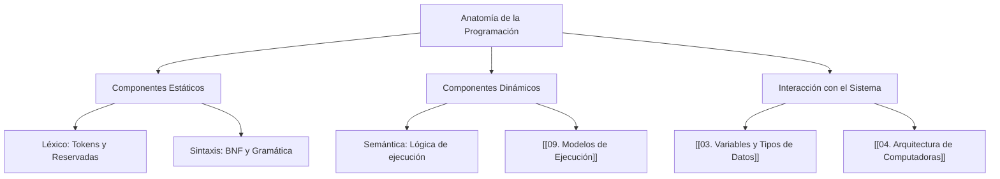
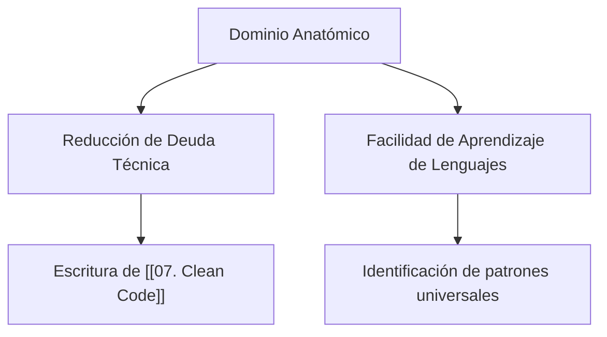

---
aliases:
  - Bases de la Programación
  - Componentes del Software
  - Software Anatomy
tags:
  - lexico_sintaxis_semantica
  - fundamentos
  - arquitectura_software
  - concepto
created: 2026-02-20 17:49
modified: 2026-02-23 13:45
rating: 5
nivel: 2
fuentes:
  - Fundamentos de Programación - Joyanes Aguilar
  - Clean Code - Robert C. Martin
  - MDN Web Docs
estado: dominado
---
# 01. Anatomía de la Programación

> [!abstract]+ Resumen
> **Idea Principal**: La anatomía de la programación es el estudio de los componentes estructurales (Léxico y Sintaxis) y funcionales (Semántica) que permiten traducir la lógica humana en instrucciones procesables por una computadora.
> **Contexto**: Para un ING. Software, esto no es solo "aprender a escribir", sino entender cómo la estructura del código impacta en el [[09. Modelos de Ejecución]] y la eficiencia en el [[15. Manejo de Errores (Debugging)]].

## 🎯 **Concepto Clave**
**Definición**: Se divide en tres pilares fundamentales que rigen cualquier lenguaje:
1.  **Léxico**: El conjunto de símbolos y palabras permitidas (Tokens).
2.  **Sintaxis**: El conjunto de reglas que definen cómo combinar esos tokens (Gramática).
3.  **Semántica**: El significado o comportamiento esperado de una construcción sintáctica válida.

> [!tip] TL;DR para Humanos:
> Programar es como construir con LEGO: El **Léxico** son las piezas disponibles, la **Sintaxis** es cómo encajan legalmente, y la **Semántica** es si lo que construiste es realmente un castillo o un montón de piezas sin sentido.

##### 💻 **Implementación / Ejemplo**

```markdown

##### Ejemplo genérico (Pseudocódigo)
Variable: limite = 10
Variable: suma = 0
Para i desde 0 hasta limite:
    suma = suma + i
FinPara
```


##### **Fórmula/Key Metric**: `Ecuación de Niklaus Wirth`
```text

Algoritmos + Estructuras de Datos = Programas
```

## 🔍 **Mapa del Concepto**


## 🔍 **¿Por qué importa?**


## 📋 **Propiedades Clave**
| *Aspecto*        | *Detalle*                                  |
| -------------- | ---------------------------------------- |
| Complejidad    | baja                                     |
| Uso frecuente  | esencial                                 |
| Complejidad (Big-O)| N/A (Fundamento Teórico)              |
| Prerequisitos  | [[00. Glosario]]                         |
| MOC Padre      | [[00_MOC Fundamentos]]                   |

## ⚠️ Errores Comunes
- **Error de Sintaxis**: El compilador/intérprete se detiene (ej: falta un paréntesis). Fácil de detectar.
- **Error de Semántica**: El programa corre pero da resultados erróneos (ej: sumar en lugar de restar). Difícil de detectar sin [[06. Testing]].
- **Ignorar el Contexto de Memoria**: Olvidar que cada elemento anatómico tiene un costo en el [[02. Stack vs. Heap (Control de Memoria Profunda)]].

## 💡 Intuición
Imagina que el código es el esqueleto de un edificio. Las variables son los materiales, las estructuras de control son los pasillos que guían el flujo, y la semántica es la función del edificio (¿Es un hospital o una cárcel?).

## 🔗 **Conexiones**
- **Entrada**: [[00. Glosario]] → Definiciones base.
- **Salida**: [[02. Binario y Lógica]] → Cómo la anatomía se traduce a bits.
- **Hermanos**: [[08. Pensamiento Algorítmico]], [[10. Compilado vs. Interpretado]].

## 🧩 Pregunta típica de entrevista
- "¿Por qué un programa puede ser sintácticamente correcto pero semánticamente erróneo?" - *Respuesta*: Porque la sintaxis solo valida las reglas de escritura, mientras que la semántica valida la lógica y el propósito de la instrucción respecto al estado del sistema.

## 🛠 Laboratorio (Active Recall)
- [ ] **Explicación Feynman**: ¿Puedo explicar cómo un bloque de código se descompone en tokens?
- [ ] **Flashcard**: ¿Cuál es la diferencia entre un error léxico y uno sintáctico?
- [ ] **Prueba de Código**: Identificar léxico, sintaxis y semántica en un script de [[Laboratorio]].

## 🚀 **Siguiente Acción**
- **Leer**: Joyanes Aguilar, Cap. 2: Metodología de la programación.
- **Explorar**: Ver cómo el [[10. Compilado vs. Interpretado]] afecta el análisis de esta anatomía.

## 📚 **Fuentes**
1. Joyanes Aguilar, L. (2008). *Fundamentos de Programación*.
2. Martin, R. C. (2008). *Clean Code*.
3. [MDN - Building Blocks](https://developer.mozilla.org/en-US/docs/Learn/JavaScript/Building_blocks).