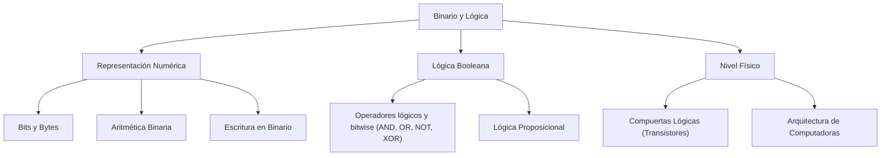
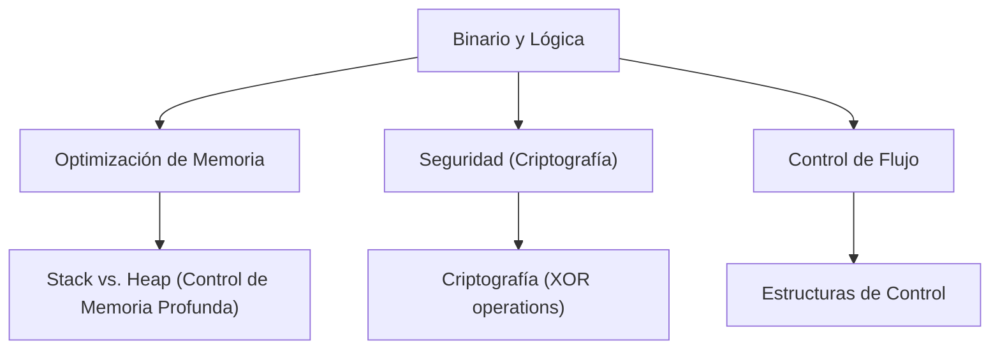

---
aliases:
  - Sistema Binario
  - Álgebra de Boole
  - Operaciones de Bits
tags:
  - concepto
  - fundamentos
  - matemáticas
  - bajo_nivel
  - cs-theory
created: 2026-02-18 18:17
modified: 2026-02-20 18:57
rating: 4
nivel: 2
fuentes:
  - Joyanes Aguilar
  - Patterson & Hennessy
estado: estudiando
---
# 2. Binario y Lógica

> [!abstract]+ Resumen
> **Idea Principal**: El sistema binario y la lógica booleana constituyen el lenguaje de "bajo nivel" del hardware, donde toda la información se representa mediante estados de encendido (1) y apagado (0), permitiendo la ejecución de instrucciones mediante compuertas lógicas.
> **Contexto**: Un Ing. de Software necesita esto para comprender la [[04. Arquitectura de Computadoras]], optimizar el almacenamiento en [[03. Variables y Tipos de Datos]] y dominar las [[05. Estructuras de Control]] basadas en condiciones de verdad.

## 🎯 **Concepto Clave**
**Definición**: El sistema binario es un sistema de numeración en base 2. La lógica proposicional (Álgebra de Boole) define las reglas para operar con estos valores (True/1, False/0) mediante conectores lógicos y bitwise (AND, OR, NOT, XOR). A nivel de hardware, esto se traduce en voltajes que atraviesan transistores en la CPU.

%% 🎨 Crear dibujo: ![[02. Binario y Lógica_Dibujo.excalidraw]] %%

> [!tip] TL;DR para Humanos:
> Las computadoras son como billones de interruptores de luz. La lógica binaria son las reglas que dicen: "Si este interruptor Y este otro están encendidos, entonces prende la lámpara".

#### 💻 **Implementación / Ejemplo**

##### **Tipos de Operadores**

> [!important] Diferencia Crítica: Lógicos vs. Bitwise
> En programación, no es lo mismo evaluar una condición que manipular bits.
> - **Lógicos** (`&&`, `||`, `!`): Trabajan con valores de verdad (`true`/`false`). Se usan para **Control de Flujo**.
> - **Bitwise** (`&`, `|`, `^`, `~`): Trabajan con los bits individuales de un número. Se usan para **Optimización y Manipulación de Datos**.

| Operación | Lógico (Condicional) | Bitwise (Nivel Bit) | Resultado esperado |
| :--- | :---: | :---: | :--- |
| **AND** | `&&` | `&` | 1 si ambos son 1 |
| **OR** | `\|\|` | `\|` | 1 si alguno es 1 |
| **XOR** | (n/a) | `^` | 1 si son diferentes |
| **NOT** | `!` | `~` | Invierte los estados |

##### **Tabla de la Verdad**

| A | B | AND | OR | XOR |
| :-: | :-: | :-: | :-: | :-: |
| 0 | 0 | 0 | 0 | 0 |
| 0 | 1 | 0 | 1 | 1 |
| 1 | 0 | 0 | 1 | 1 |
| 1 | 1 | 1 | 1 | 0 |

| A | NOT |
| :-: | :-: |
| 0 | 1 |
| 1 | 0 |

##### **Ejemplo de Diferencias**
```js

// 1. USO LÓGICO: Toma de decisiones
let edad = 20
let tienePermiso = true
if (edad >= 18 && tienePermiso) { 
    console.log("Acceso concedido")
// Evalúa la verdad total
}

// 2. USO BITWISE: Manipulación de datos (Permisos/Flags)

// Imaginemos: Leer=4 (100), Escribir=2 (010), Ejecutar=1 (001)
const READ = 4, WRITE = 2, EXECUTE = 1

let misPermisos = READ | WRITE
// Resultado: 6 (110 en binario)

let puedeEscribir = (misPermisos & WRITE) !== 0
// true (comprueba el bit específico)
```

> [!tip] La magia del XOR (Exclusive OR)
> El XOR es fundamental en [[01. Criptografía]]. Nota que el resultado es `1` solo cuando las entradas son diferentes. Si aplicas XOR dos veces con la misma clave, recuperas el valor original.

##### **Fórmula/Key Metric**: `Notación Polinómica` Y `Algoritmo de Divisiones Sucesivas`

###### *Ecuación General*
$$
N = \sum_{i=0}^{n-1}d_i\cdot b^i
$$
###### *Ecuación Expandida*
$$
N = d_{n-1}\cdot b^{n-1} + d_{n-2}\cdot b^{n-2} + \dots + d_1 \cdot b^1 + d_0 \cdot b^0
$$
###### *Ejemplo*
$$
1011₂ = 1·2³ + 0·2² + 1·2¹ + 1·2⁰
$$

```markdown

%% Algoritmo de Divisiones Sucesivas (No hay Formula)
**Se sigue una serie de pasos:**
1. Dividir el número decimal entre 2
2. El residuo (0 o 1) es el dígito binario
3. Repetir con el cociente hasta llegar a 0
4. Leer los residuos en orden inverso (del último al primero)
   
%% Ejemplo
**Convertir el 25 a decimal:**
1. 25 ÷ 2 = 12 | Residuo: 1
2. 12 ÷ 2 = 6 | Residuo: 0
3. 6 ÷ 2 = 3 | Residuo: 0
4. 3 ÷ 2 = 1 | Residuo: 1
5. 1 ÷ 2 = 0 | Residuo: 1
   
**Resultado:**
25₁₀ = 11001₂

*Nota:* Hay formas más sencillas, rápidas y útiles que esta, pero no está de más saber la versión original.
```

##### 🧮 Aritmética Binaria (Operaciones de Bajo Nivel)
- Suma: Base de todo el cálculo en CPU (1+1=10).
- Negativos: Se gestionan mediante Complemento a 2.
- Shifting: Multiplicar/Dividir por 2 desplazando bits.

> [!important] Profundización:
> Para profundizar más en Lógica Proposicional, ver la Nota: [[02. Lógica Proposicional]].
> Para profundizar más en Aritmética de Binarios, ver la Nota: [[07. Representación de Enteros]].

## 🔍 **Mapa del Concepto**


## 🔍 **¿Por qué importa?**


## 📋 **Propiedades Clave**
| Aspecto       | Detalle              |
| ------------- | -------------------- |
| Complejidad   | media                |
| Uso frecuente | esencial             |
| Complejidad (Big-O)| O(1) operaciones de bits |
| Prerequisitos | [[01. Anatomía de la Programación]], [[01. Matemática Discreta]] |
| MOC Padre     | [[00_MOC Fundamentos]] |

## ⚠️ Errores Comunes
- **Confundir Bitwise (&) con Logical (&&)**: Operar sobre la representación binaria total vs. evaluar un valor de verdad.
- **Overflow**: Olvidar que los tipos de datos tienen un límite de bits en [[03. Variables y Tipos de Datos]].

## 💡 Intuición
Imagina que estás dando instruccion código Morse. Solo tienes dos señales. Para decir números complejos o tomar decisiones, necesitas combinar esas señales siguiendo reglas estrictas de "si esto, entonces aquello".

## 🔗 **Conexiones**
- **Entrada**: [[01. Anatomía de la Programación]] → Esta nota
- **Salida**: Esta nota → [[03. Variables y Tipos de Datos]]
- **Hermanos**: [[02. Lógica Proposicional]], [[04. Arquitectura de Computadoras]], [[07. Representación de Enteros]], [[08. IEEE 754]], [[09. Endianness]], [[10. Codificación de Texto]]

## 🧩 Pregunta típica de entrevista
- ¿Cómo verificarías si un número es par o impar usando únicamente operadores de bits? (Pista: `n & 1`).

## 🛠 Laboratorio (Active Recall)
- [x] Explicación Feynman: ¿Puedo explicar por qué 11111111 en 8 bits puede ser 255 o -1 dependiendo del contexto?
- [x] Prueba: Convertir mi edad a binario usando la suma de potencias en menos de 10 segundos.
- [x] Código: Investigar cómo chmod 777 en Linux usa binario para dar permisos de Lectura (4), Escritura (2) y Ejecución (1).

> [!note] Respuestas
> 1. En sistemas con signo, el valor máximo de bits encendidos suele representar el -1 debido al desbordamiento natural en la aritmética de complemento a 2
> 2. ¿Cabe 17 en 16? **Si** → 1, 17-16=1; ¿Cabe 1 en 8? *No* → 0; ¿Cabe 1 en 4? *No* → 0; ¿Cabe 1 en 2? *No* → 0; ¿Cabe 1 en 1? **Si** → 1, 1-1=0. Mi edad se escribe: **10001 → 17**
> 3. Antes de buscar daré la respuesta que creo correcta. Usa operadores bitwise, así como tú hiciste el ejemplo en chmod 777 se usa el OR (|) para activar un bit y dar permisos, se usa el AND (&) para comprobar si se tiene permisos o no, el XOR para togglear permisos. **PD:** Después de investigar... Era lo que dije pero más agregado, básicamente lo que aprendí es que chmod 777 se llama así porque lectura, escritura y ejecución cada uno de esos valen 3 bits, el primer bit es del Dueño, el segundo bit es del Grupo y el tercer bit es de Otros, si activamos los 3 bits entonces sería: 111 → 7, y si activa los tres 7s (chmod 777) le daría poder a que cualquier persona en el mundo o proceso de la computadora ejecute ese archivo. Si activa 101 por ejemplo entonces ese archivo puede leerse y ejecutarse pero no editarse, si activa 110 puede leerse, editarse pero no ejecutarse, 011 puede editarse, ejecutarse pero no leerse, etc, etc.

## 🚀 **Siguiente Acción**
- **Estudiar**: Complemento a 2 para representación de números negativos.
- **Hacer**: Ejercicios de conversión rápida en [[Laboratorio]].

## 📚 **Fuentes**
1. Patterson, D. A., & Hennessy, J. L. *Computer Organization and Design*.
2. Joyanes Aguilar, L. *Fundamentos de Programación*.
3. [Python Docs - Bitwise Operations](https://docs.python.org/3/library/stdtypes.html#bitwise-operations-on-integer-types)
