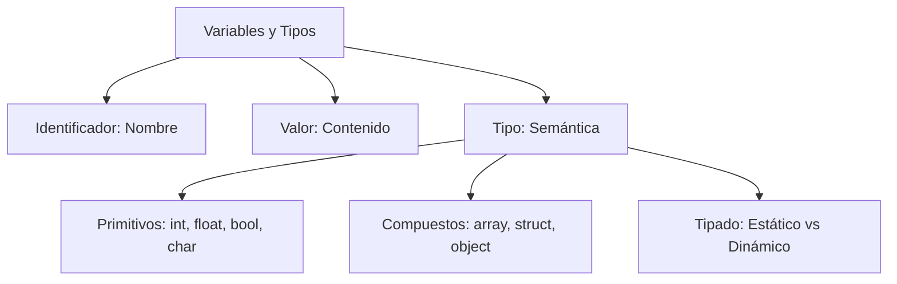
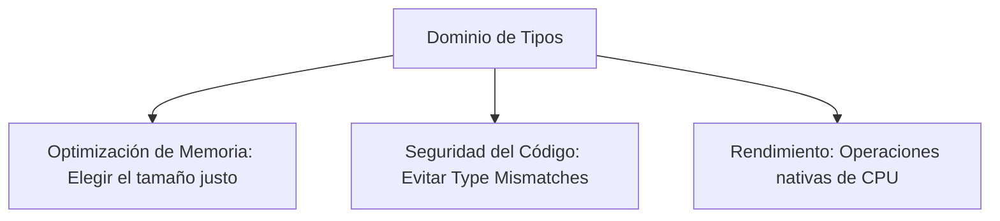

---
aliases:
  - Variables y Tipos
  - Data Types
tags:
  - tipos_de_datos
  - gestion_de_memoria
  - fundamentos_programacion
  - tipado_estatico_dinamico
created: 2026-02-21 18:43
modified: 2026-02-23 13:09
rating: 5
nivel: 2
fuentes:
  - Principles, Techniques, and Tools (Dragon Book)
  - Clean Code - Robert C. Martin
  - Sebasta
  - MDN
estado: dominado
---
# 03. Variables y Tipos de Datos

> [!abstract]+ Resumen
> **Idea Principal**: Una **variable** es un nombre simbólico (identificador) vinculado a un espacio en memoria que almacena un valor. El **tipo de dato** define la naturaleza de ese valor, determinando qué operaciones son válidas y cuánta memoria física se requiere.
> **Contexto**: Para un Ingeniero de Software, entender esto es el primer paso para la optimización de recursos y la prevención de errores en tiempo de ejecución (Runtime).

## 🎯 **Concepto Clave**
**Definición**: Una variable es una abstracción de una celda de memoria. El tipo de dato actúa como un "contrato" o metadato que le indica al compilador o intérprete cómo interpretar los bits almacenados (ej. si `01000001` es el número `65` o la letra `'A'`).

> [!tip] TL;DR para Humanos:
> Imagina que la memoria es un almacén lleno de cajas. Una **variable** es la etiqueta que le pegas a la caja para encontrarla. El **tipo de dato** es la forma de la caja (redonda, cuadrada) que dicta qué puedes meter dentro y qué tan grande es.

##### 💻 **Implementación / Ejemplo**

```markdown

##### Ejemplo Conceptual
- Declaración: int edad; (Reserva 4 bytes en muchos sistemas)
- Asignación: edad = 20; (Escribe el valor binario en la dirección reservada)
```


##### **Fórmula/Key Metric**: `Capacidad de Almacenamiento`
###### *Números UnSigned*
$$
n_bits = [0, 2^n - 1]
$$
###### *Números Signed*
$$
n_{bits} = [-2^{n-1}, 2^{n-1} - 1]
$$

## 🔍 **Mapa del Concepto**



## 🔍 **¿Por qué importa?**


## 📋 **Propiedades Clave**
| *Aspecto*       | *Detalle*                               |
| -------------- | ------------------------------------- |
| Complejidad    | baja                                  |
| Uso frecuente  | esencial                              |
| Complejidad (Big-O)| O(1) para acceso y asignación     |
| Prerequisitos  | [[02. Binario y Lógica]]              |
| MOC Padre      | [[00_MOC Fundamentos]]                |

## ⚠️ Errores Comunes
- **Overflow**: Intentar meter un valor más grande de lo que el tipo permite (ej. meter 300 en un `byte` que llega a 255).
- **Type Coercion Involuntaria**: En lenguajes como JS, sumar `"5" + 1` resulta en `"51"` en lugar de `6`.
- **Confundir Declaración con Inicialización**: Declarar reserva el nombre; inicializar le da el primer valor.

## 💡 Intuición
Si vas a mudarte, no usas una caja de refrigerador para guardar un solo cepillo de dientes. Elegir el tipo de dato correcto es elegir el empaque adecuado para que tu "mudanza" (ejecución del programa) sea eficiente.

## 🔗 **Conexiones**
- **Entrada**: [[01. Anatomía de la Programación]] → Cómo se estructuran las instrucciones.
- **Salida**: [[04. Operadores y Expresiones]] → Qué hacemos con las variables.
- **Hermanos**: [[07. Representación de Enteros]], [[08. IEEE 754]], [[02. Stack vs. Heap (Control de Memoria Profunda)]], [[09. Modelos de Ejecución]], [[07. Abstracción]] (Relación con **06_SISTEMAS** para entender cómo se guardan físicamente).

## 🧩 Pregunta típica de entrevista
- **¿Cuál es la diferencia entre tipado estático y dinámico?** - *Respuesta*: En el estático (Java, C++), el tipo se define en tiempo de compilación. En el dinámico (Python, JS), el tipo se asocia al valor en tiempo de ejecución.

## 🛠 Laboratorio (Active Recall)
- [ ] **Explicación Feynman**: ¿Puedo explicar la diferencia entre un puntero y una variable primitiva?
- [ ] **Flashcard**: ¿Qué sucede con la memoria cuando una variable sale de su scope? ([[02. Stack vs. Heap (Control de Memoria Profunda)]]).
- [ ] **Prueba de Código**: Crear un programa que cause un overflow intencional en [[Laboratorio]].

## 🚀 **Siguiente Acción**
- **Leer**: *Clean Code*, Capítulo 2 sobre Nombres Significativos para variables.
- **Hacer**: Investigar cuántos bytes ocupa un `int` en el lenguaje que más uses.

## 📚 **Fuentes**
1. Sebesta, R. W. (2018). *Concepts of Programming Languages*.
2. Documentación oficial de MDN sobre [Data Structures](https://developer.mozilla.org/en-US/docs/Web/JavaScript/Data_structures).
