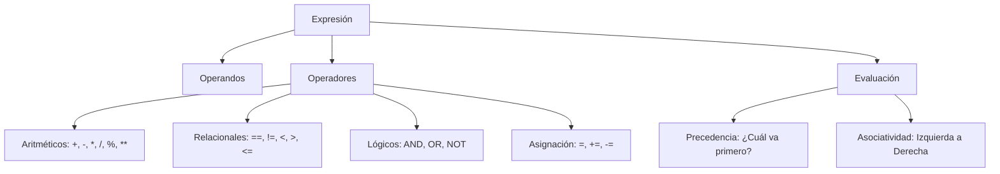
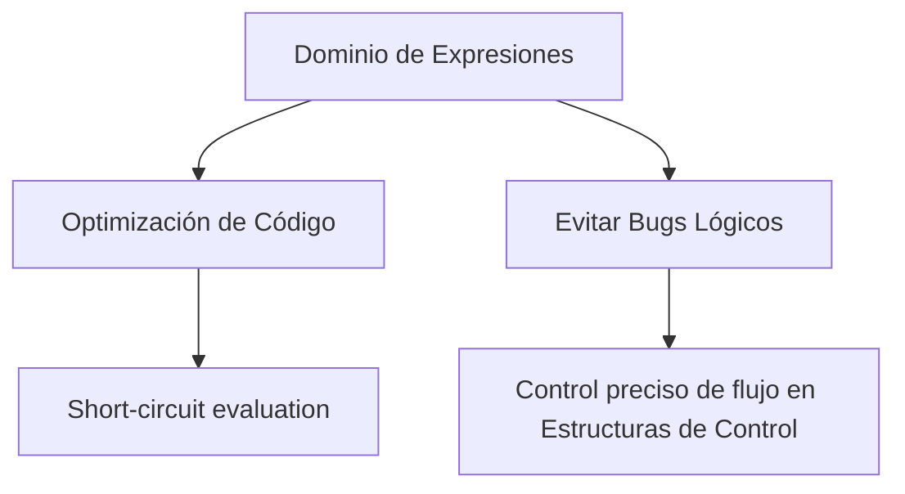

---
aliases:
  - Operadores
  - Lógica de Expresiones
tags:
  - operadores_aritmeticos
  - logica_booleana
  - precedencia_operadores
  - expresiones_computacionales
  - fundamentos
created: 2026-02-18 18:21
modified: 2026-02-23 14:55
rating: 5
nivel: 2
fuentes:
  - C Programming Language - Kernighan & Ritchie
  - "Java: The Complete Reference - Herbert Schildt"
estado: dominado
---
# 04. Operadores y Expresiones

> [!abstract]+ Resumen
> **Idea Principal**: Los **operadores** son símbolos que indican al compilador o intérprete la ejecución de una operación específica (matemática, lógica o relacional). Una **expresión** es una combinación de operandos y operadores que se evalúa para producir un único valor.
> **Contexto**: Son el "motor" del procesamiento de datos. Sin ellos, las variables serían estáticas; las expresiones permiten que el software tome decisiones y realice cálculos.

## 🎯 **Concepto Clave**
**Definición**: Los operadores actúan sobre uno o más **operandos**. Se clasifican por su función (Aritméticos, Relacionales, Lógicos, de Asignación, Bitwise) y por su aridad (Unarios, Binarios, Ternarios). La evaluación de expresiones sigue reglas estrictas de **Precedencia** (orden de importancia) y **Asociatividad** (dirección de evaluación).

> [!tip] TL;DR para Humanos:
> Los operadores son los verbos de la oración. Si las variables son nombres ("manzanas", "canastas"), los operadores son las acciones ("sumar", "comparar", "meter en"). Una expresión es la oración completa que da un resultado.

##### 💻 **Implementación / Ejemplo**

```markdown

##### Ejemplo genérico
Expresión: (x + y) * 2 > z
1. Evalúa (x + y) -> Aritmético
2. Multiplica por 2 -> Aritmético
3. Compara con z -> Relacional
4. Resultado -> Booleano (True/False)
```


##### **Fórmula/Key Metric**: `Orden de Precedencia Estándar (PEMDAS/BODMAS)`
```text

1. Paréntesis ()
2. Exponentes **
3. Multiplicación/División * /
4. Suma/Resta + -
5. Relacionales < > ==
6. Lógicos AND/OR
```

## 🔍 **Mapa del Concepto**



## 🔍 **¿Por qué importa?**


## 📋 **Propiedades Clave**
| *Aspecto*        | *Detalle*                               |
| -------------- | ------------------------------------- |
| Complejidad    | media (por precedencia)               |
| Uso frecuente  | esencial                              |
| Complejidad (Big-O)| O(1) la mayoría de operaciones básicas |
| Prerequisitos  | [[03. Variables y Tipos de Datos]], [[02. Binario y Lógica]] |
| MOC Padre      | [[00_MOC Fundamentos]]                |

## ⚠️ Errores Comunes
- **División por cero**: Genera excepciones o errores de tiempo de ejecución.
- **Efectos secundarios (Side Effects)**: Usar operadores de incremento (`i++`) dentro de expresiones complejas, dificultando la lectura.
- **Confundir `=` con `==`**: El primero asigna, el segundo compara. Es el bug más clásico.

## 💡 Intuición
Imagina que estás resolviendo un acertijo matemático. Los operadores son las reglas que te dicen qué hacer con los números. Si ignoras las reglas (como el orden de las operaciones), llegarás a una respuesta, pero será la equivocada.

## 🔗 **Conexiones**
- **Entrada**: [[03. Variables y Tipos de Datos]] → Los valores que operamos.
- **Salida**: [[05. Estructuras de Control]] → Usamos expresiones para decidir caminos.
- **Hermanos**: [[02. Binario y Lógica]] (Operadores AND/OR), [[07. Representación de Enteros]] (Operadores Bitwise).

## 🧩 Pregunta típica de entrevista
- **¿Qué es el cortocircuito (Short-circuit) en operadores lógicos?** - *Respuesta*: Es una optimización donde el segundo operando no se evalúa si el primero ya define el resultado (ej. en `A AND B`, si `A` es falso, no importa `B`, el resultado es falso).

## 🛠 Laboratorio (Active Recall)
- [ ] **Explicación Feynman**: ¿Puedo explicar por qué `3 + 4 * 2` no es `14`?
- [ ] **Flashcard**: ¿Qué diferencia hay entre `/` y `%` (módulo)?
- [ ] **Prueba de Código**: Escribir una expresión que use al menos 4 tipos de operadores y predecir el resultado en [[Laboratorio]].

## 🚀 **Siguiente Acción**
- **Hacer**: Crear una tabla de verdad para una expresión compleja con 3 variables booleanas.
- **Explorar**: Cómo funcionan los operadores Bitwise (`<<`, `>>`, `&`, `|`) y su relación con [[06_SISTEMAS]].

## 📚 **Fuentes**
1. Ritchie, D. M., & Kernighan, B. W. (1988). *The C Programming Language*.
2. [Ecma International - ECMAScript Expressions](https://tc39.es/ecma262/#sec-ecmascript-language-expressions).
