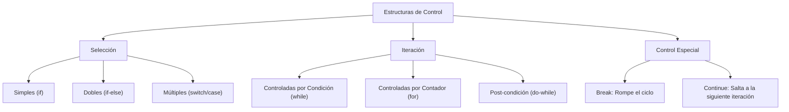
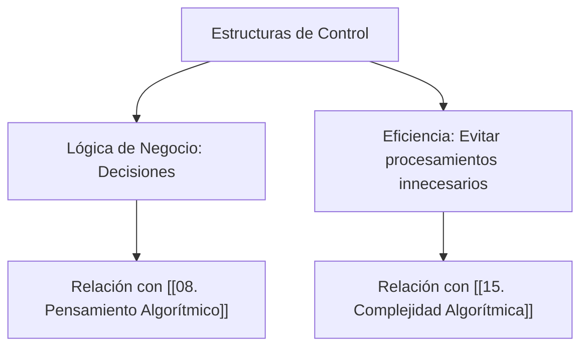

---
aliases:
  - Flujo de Control
  - Control Flow
tags:
  - estructuras_de_control
  - algoritmos
  - logica_programacion
  - bifurcaciones
  - bucles
  - fundamentos
created: 2026-02-18 18:19
modified: 2026-02-23 16:36
rating: 5
nivel: 2
fuentes:
  - Introduction to Algorithms (CLRS)
  - Code Complete - Steve McConnell
estado: estudiando
---
# 05. Estructuras de Control

> [!abstract]+ Resumen
> **Idea Principal**: Las **estructuras de control** son bloques de construcción que determinan el flujo de ejecución de un programa. Permiten que el código deje de ser una secuencia lineal para volverse dinámico, permitiendo tomar decisiones (**Bifurcaciones**) y repetir tareas (**Bucles**).
> **Contexto**: Para un ING. Software, dominar estas estructuras es la base para implementar la lógica de negocios y algoritmos complejos. Su mal uso conduce a código espagueti o bucles infinitos.

## 🎯 **Concepto Clave**
**Definición**: Son instrucciones que controlan si otras instrucciones se ejecutan o no, y cuántas veces. Se basan en la evaluación de una **expresión booleana** (True/False). 

Existen tres tipos fundamentales según el Teorema del Programa Estructurado:
1.  **Secuencia**: El orden natural (arriba hacia abajo).
2.  **Selección (Bifurcaciones)**: `if/else`, `switch/case`.
3.  **Iteración (Bucles)**: `while`, `for`, `do-while`.

> [!tip] TL;DR para Humanos:
> Es como un libro de "Elige tu propia aventura":
> - **If**: "Si tienes la llave, ve a la página 10; si no, ve a la 20".
> - **For/While**: "Limpia el piso hasta que esté brillante" (repite la acción).

##### 💻 **Implementación / Ejemplo**

```markdown

##### Ejemplo genérico (Pseudocódigo)
SI usuario_esta_logueado ENTONCES
    MOSTRAR "Bienvenido"
SINO
    MOSTRAR "Por favor, inicie sesión"
FIN SI
```


##### **Fórmula/Key Metric**: `Complejidad Ciclomática`
```text

M = E - N + 2P

Donde:
E=aristas
N=nodos
P=componentes conexos

Mide cuántos caminos independientes tiene tu código.
```

## 🔍 **Mapa del Concepto**



## 🔍 **¿Por qué importa?**


## 📋 **Propiedades Clave**
| *Aspecto*        | *Detalle*                               |
| -------------- | ------------------------------------- |
| Complejidad    | media                                 |
| Uso frecuente  | esencial                              |
| Complejidad (Big-O)| O(n) en bucles simples, O(n^k) en anidados |
| Prerequisitos  | [[04. Operadores y Expresiones]]      |
| MOC Padre      | [[00_MOC Fundamentos]]                |

## ⚠️ Errores Comunes
- **Bucle Infinito**: La condición de parada nunca se cumple (ej: `while(true)` sin un `break`).
- **Off-by-one Error**: El bucle se ejecuta una vez más o una vez menos de lo esperado (común en el uso de `<` vs `<=`).
- **Anidamiento Excesivo**: El "Código Arrow" (muchos IFs dentro de otros), lo cual viola principios de [[07. Clean Code]].

## 💡 Intuición
Imagina que eres un guardia de seguridad. El `if` es tu lista de invitados (si está en la lista, pasa). El `while` es tu instrucción de "patrullar mientras sea de noche". Cuando amanece (la condición cambia a falso), dejas de patrullar.

## 🔗 **Conexiones**
- **Entrada**: [[04. Operadores y Expresiones]] → Evaluamos expresiones para controlar el flujo.
- **Salida**: [[06. Funciones y Modularización]] → Encapsulamos estructuras de control en bloques reutilizables.
- **Hermanos**: [[08. Pensamiento Algorítmico]], [[15. Manejo de Errores (Debugging)]].

## 🧩 Pregunta típica de entrevista
- **¿Cuál es la diferencia entre un bucle `for` y un `while`?** - *Respuesta*: El `for` se prefiere cuando conocemos de antemano el número de iteraciones (basado en un rango o colección). El `while` se usa cuando la repetición depende de una condición que puede cambiar en cualquier momento.

## 🛠 Laboratorio (Active Recall)
- [ ] **Explicación Feynman**: ¿Puedo dibujar el diagrama de flujo de un `switch` vs un `if-else` anidado?
- [ ] **Flashcard**: ¿Qué sucede si la condición de un `do-while` es falsa desde el inicio? (Respuesta: Se ejecuta exactamente una vez).
- [ ] **Prueba de Código**: Implementar un algoritmo de búsqueda simple usando un bucle y una bifurcación en [[Laboratorio]].

## 🚀 **Siguiente Acción**
- **Hacer**: Refactorizar un código con 3 niveles de `if` anidados usando la técnica de "Cláusulas de Guarda" (Early Return).
- **Leer**: Capítulo sobre "Control Flow" en la documentación oficial de tu lenguaje principal.

## 📚 **Fuentes**
1. Cormen, T. H. (2009). *Introduction to Algorithms*.
2. McConnell, S. (2004). *Code Complete*