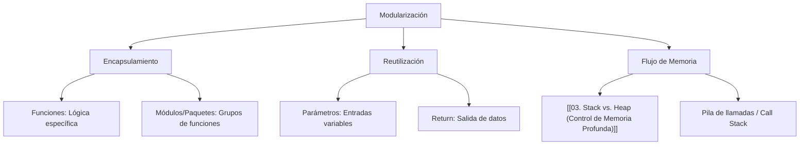
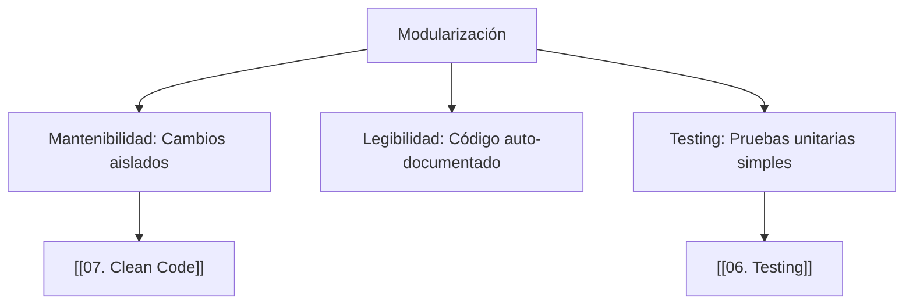

---
aliases:
  - Funciones
  - Modularidad
  - Procedimientos
tags:
  - modularizacion
  - abstraccion_funciones
  - reutilizacion_codigo
  - fundamentos_programacion
  - fundamentos
created: 2026-02-18 18:20
modified: 2026-02-23 16:53
rating: 5
nivel: 2
fuentes:
  - Clean Code - Robert C. Martin
  - Structure and Interpretation of Computer Programs (SICP)
estado: estudiando
---
# 06. Funciones y Modularización

> [!abstract]+ Resumen
> **Idea Principal**: Las **funciones** son bloques de código autónomos diseñados para realizar una tarea específica, mientras que la **modularización** es la técnica de dividir un sistema complejo en partes más pequeñas (módulos) e independientes.
> **Contexto**: Para un Ingeniero de Software, este es el pilar de la escalabilidad y el mantenimiento. Permite aplicar el principio de "Divide y Vencerás", facilitando el [[06. Testing]] y la colaboración en equipo.

## 🎯 **Concepto Clave**
**Definición**: Una función es una unidad lógica que acepta entradas (**parámetros**), realiza una transformación y devuelve una salida (**valor de retorno**). La modularización organiza estas funciones y datos relacionados en entidades separadas para reducir el acoplamiento y aumentar la cohesión.

Conceptos fundamentales:
- **Firma (Signature)**: Nombre, parámetros y tipo de retorno.
- **Ámbito (Scope)**: El contexto donde una variable es visible (Local vs. Global).
- **Abstracción**: El usuario de la función sabe *qué* hace, pero no necesariamente *cómo* lo hace.

> [!tip] TL;DR para Humanos:
> Una función es como una **máquina de café**: le das granos y agua (parámetros), ella hace su magia interna (cuerpo de la función) y te entrega una taza de café (retorno). La modularización es la **cocina**, donde cada electrodoméstico tiene su propia tarea y lugar.

##### 💻 **Implementación / Ejemplo**

```markdown

##### Ejemplo genérico
Función sumar(a, b):
    Retornar a + b

Resultado = sumar(5, 3)
```


##### **Fórmula/Key Metric**: `Principio de Responsabilidad Única (SRP)`
```text

Una función debe hacer una sola cosa y hacerla bien. 
Idealmente: < 20 líneas de código.
```

## 🔍 **Mapa del Concepto**



## 🔍 **¿Por qué importa?**


## 📋 **Propiedades Clave**
| *Aspecto*        | *Detalle*                               |
| -------------- | ------------------------------------- |
| Complejidad    | media                                 |
| Uso frecuente  | esencial                              |
| Complejidad (Big-O)| Depende del cuerpo de la función     |
| Prerequisitos  | [[05. Estructuras de Control]]        |
| MOC Padre      | [[00_MOC Fundamentos]]                |

## ⚠️ Errores Comunes
- **Efectos Secundarios (Side Effects)**: Una función que modifica variables globales inesperadamente.
- **Funciones "Dios"**: Funciones gigantes que hacen demasiadas cosas (violan el SRP).
- **Exceso de Parámetros**: Si una función recibe más de 3-4 parámetros, suele ser señal de que debe dividirse o usar un objeto/estructura.

## 💡 Intuición
Imagina que escribes una carta. En lugar de escribir tu nombre y dirección a mano 100 veces, mandas a hacer un **sello**. El sello es la **función**: lo creas una vez y lo usas donde quieras. Si cambias de dirección, solo cambias el sello, no las 100 cartas.

## 🔗 **Conexiones**
- **Entrada**: [[05. Estructuras de Control]] → La lógica interna de la función.
- **Salida**: [[07. Abstracción]] → El siguiente nivel de ocultamiento de complejidad.
- **Hermanos**: [[22. Recursión]], [[10. DRY-KISS-YAGNI]].

## 🧩 Pregunta típica de entrevista
- **¿Cuál es la diferencia entre pasar por valor y pasar por referencia?** - *Respuesta*: Al pasar por **valor**, se envía una copia del dato (típico en primitivos); al pasar por **referencia**, se envía la dirección de memoria (típico en objetos), por lo que los cambios dentro de la función afectan al original.

## 🛠 Laboratorio (Active Recall)
- [ ] **Explicación Feynman**: ¿Puedo explicar cómo funciona la "Pila de Llamadas" (Call Stack) cuando una función llama a otra?
- [ ] **Flashcard**: ¿Qué es una función pura? (Respuesta: Aquella que para la misma entrada siempre da la misma salida y no tiene efectos secundarios).
- [ ] **Prueba de Código**: Dividir un script largo de [[Laboratorio]] en 3 funciones independientes.

## 🚀 **Siguiente Acción**
- **Hacer**: Identificar en un proyecto propio una función que tenga más de 30 líneas y refactorizarla en 2 o 3 funciones menores.
- **Leer**: Capítulo 3 de *Clean Code*: "Functions".

## 📚 **Fuentes**
1. Martin, R. C. (2008). *Clean Code*.
2. Abelson, H., & Sussman, G. J. (1996). *SICP*.
