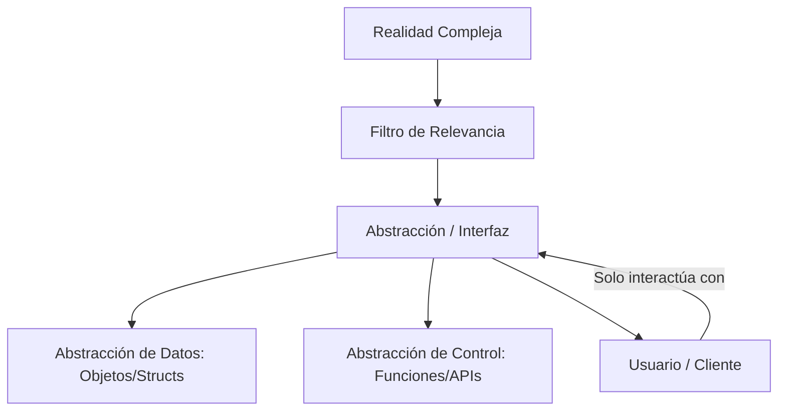
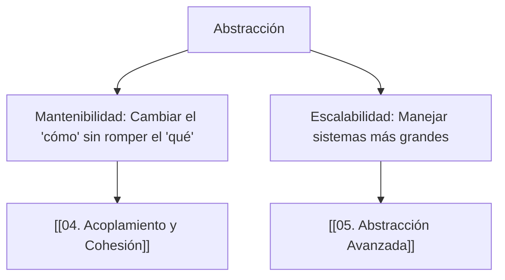

---
aliases:
  - Ocultamiento de Información
  - Capas de Abstracción
tags:
  - arquitectura_limpia
  - modelado_software
  - simplificacion_sistemas
  - fundamentos
  - abstracción
  - concepto
created: 2026-02-18 20:16
modified: 2026-02-23 16:59
rating: 5
nivel: 2
fuentes:
  - The Pragmatic Programmer - Andrew Hunt
  - Code Complete - Steve McConnell
estado: Nunca se termina de aprender
---
# 07. Abstracción

> [!abstract]+ Resumen
> **Idea Principal**: La **abstracción** es el proceso de simplificar una entidad compleja resaltando los detalles esenciales y ocultando los detalles de implementación irrelevantes para el nivel actual de uso.
> **Contexto**: Es la herramienta mental más poderosa de un Ingeniero de Software. Permite manejar sistemas masivos sin que el cerebro colapse, creando interfaces claras y separando el "qué hace" del "cómo lo hace".

## 🎯 **Concepto Clave**
**Definición**: En computación, la abstracción consiste en definir una interfaz o modelo que representa un concepto. No es solo "quitar detalles", es **enfocarse en el contrato**.
- **Niveles de Abstracción**: El software es una torre de abstracciones (ej: el código de alto nivel abstrae el ensamblador, que abstrae el código máquina, que abstrae los voltajes eléctricos).
- **Abstracción de Datos**: Usar un tipo `Usuario` en lugar de manejar 5 strings y 2 enteros por separado.
- **Abstracción de Control**: Usar una función `enviarEmail()` sin saber cómo se conecta el protocolo SMTP.

> [!tip] TL;DR para Humanos:
> Usar un **volante** es una abstracción. No necesitas saber cómo se mueven los pistones, cómo fluye la gasolina o cómo giran los ejes. Solo sabes que si giras el volante a la derecha, el auto va a la derecha. El volante es la **interfaz abstracta** del motor.

##### 💻 **Implementación / Ejemplo**

```markdown

##### Ejemplo genérico: API
Llamas a la función `autenticar(user, pass)`.
- **Qué sabes**: Si tuvo éxito o no.
- **Qué NO sabes**: Si la base de datos es SQL, si usa hashing SHA-256 o Argon2, o si el servidor está en AWS. Eso está abstraído.
```


##### **Fórmula/Key Metric**: `Leaky Abstraction (Abstracción con fugas)`
```text

"Toda abstracción no trivial tiene fugas". 
Ocurre cuando los detalles internos (errores de red, falta de memoria) 
se filtran a través de la capa abstracta y obligan al usuario a entender el "cómo".
```

## 🔍 **Mapa del Concepto**



## 🔍 **¿Por qué importa?**


## 📋 **Propiedades Clave**
| Aspecto        | Detalle                               |
| -------------- | ------------------------------------- |
| Complejidad    | alta (mentalmente)                    |
| Uso frecuente  | constante                             |
| Complejidad (Big-O)| N/A (Concepto de Diseño)           |
| Prerequisitos  | [[06. Funciones y Modularización]]    |
| MOC Padre      | [[00_MOC Fundamentos]]                |

## ⚠️ Errores Comunes
- **Sobre-abstracción**: Crear capas innecesarias para problemas simples ("Matar una mosca con un cañón").
- **Abstracciones Prematuras**: Abstraer algo antes de entender realmente el patrón (viola **[[10. DRY-KISS-YAGNI]]**).
- **Ignorar las fugas**: No manejar los errores de bajo nivel en la capa de alto nivel.

## 💡 Intuición
Imagina que pides comida por una app. Tu interfaz es un botón de "Pedir". La abstracción oculta al cocinero, al repartidor, al tráfico y al sistema de pagos. Para ti, la comida simplemente "aparece". Eso es una abstracción exitosa.

## 🔗 **Conexiones**
- **Entrada**: [[06. Funciones y Modularización]] → La base para crear abstracciones de control.
- **Salida**: [[01. Paradigmas de Programación]] → Cómo diferentes paradigmas (OOP, Funcional) manejan la abstracción.
- **Hermanos**: [[05. Abstracción Avanzada]], [[08. Arquitectura en Capas]].

## 🧩 Pregunta típica de entrevista
- **¿Qué es una "Leaky Abstraction"?** - *Respuesta*: Es cuando los detalles de implementación de una capa se filtran hacia la capa superior. Por ejemplo, cuando una base de datos falla y la interfaz de usuario muestra un error técnico de SQL en lugar de un mensaje amigable.

## 🛠 Laboratorio (Active Recall)
- [ ] **Explicación Feynman**: ¿Puedo explicar los niveles de abstracción desde el hardware hasta una página web?
- [ ] **Flashcard**: ¿Cuál es la diferencia entre encapsulamiento y abstracción? (Abstracción: Ocultar complejidad; Encapsulamiento: Ocultar datos/estado).
- [ ] **Prueba de Diseño**: En [[Laboratorio]], diseña la interfaz de un sistema de archivos sin mencionar discos duros o bits.

## 🚀 **Siguiente Acción**
- **Hacer**: Analizar una librería que uses (ej: React o Pandas) y listar 3 cosas que abstrae para ti.
- **Leer**: El artículo clásico de Joel Spolsky: "The Law of Leaky Abstractions".

## 📚 **Fuentes**
1. Hunt, A., & Thomas, D. (1999). *The Pragmatic Programmer*.
2. Liskov, B., & Guttag, J. (2000). *Program Development in Java: Abstraction, Specification, and Object-Oriented Design*.

---
**¿Quieres que analicemos cómo la Abstracción se convierte en interfaces y clases abstractas en [[05. Abstracción Avanzada]]?**
