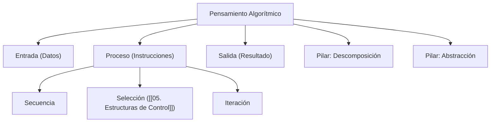
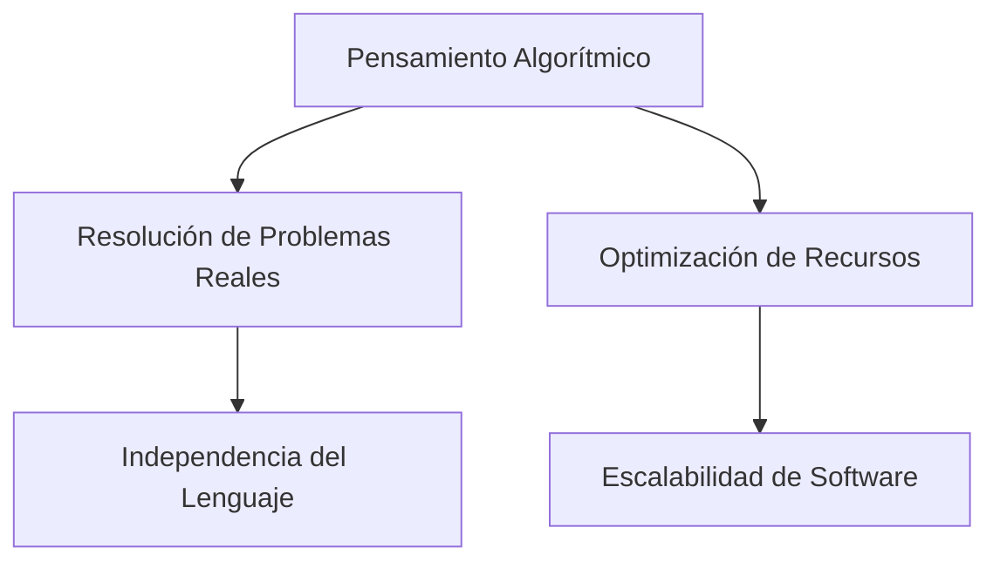

---
aliases:
  - Lógica Algorítmica
  - Computational Thinking
tags:
  - pensamiento_algoritmico
  - resolucion_problemas
  - abstraccion
  - logica_programacion
  - fundamentos
  - concepto
created: 2026-02-18 19:52
modified: 2026-02-23 17:23
rating: 5
nivel: 1
fuentes:
  - Introduction to Algorithms - Cormen
  - Computational Thinking - Jeannette Wing
estado: Nunca se termina de aprender
---
# 08. Pensamiento Algorítmico

> [!abstract]+ Resumen
> **Idea Principal**: El pensamiento algorítmico es la capacidad de descomponer problemas complejos en una serie de pasos lógicos, finitos y definidos que una computadora (o humano) puede ejecutar para alcanzar una solución.
> **Contexto**: Es el núcleo de la informática. Antes de escribir código en [[11. LENGUAJES]], un ingeniero debe diseñar la estrategia lógica. Es lo que separa a un "picacodigo" de un Ingeniero de Software.

## 🎯 **Concepto Clave**
**Definición**: Es un proceso mental que involucra cuatro pilares fundamentales:
1. **Descomposición**: Dividir un problema grande en subproblemas manejables.
2. **Reconocimiento de Patrones**: Identificar similitudes con problemas resueltos anteriormente.
3. **Abstracción**: Eliminar detalles irrelevantes para enfocarse en lo esencial (Ver [[07. Abstracción]]).
4. **Diseño de Algoritmos**: Crear las instrucciones paso a paso.

Un algoritmo debe ser:
- **Preciso**: Sin ambigüedades.
- **Definido**: Si se sigue dos veces con la misma entrada, se obtiene el mismo resultado.
- **Finito**: Debe terminar en algún momento.

> [!tip] TL;DR para Humanos:
> Es como escribir una receta de cocina para alguien que no sabe absolutamente nada. No puedes decir "cocina hasta que esté rico"; debes decir "calienta a 180°C por 20 minutos".

##### 💻 **Implementación / Ejemplo**


```markdown
##### Ejemplo genérico: Algoritmo para cruzar la calle
1. Mirar a la izquierda.
2. Mirar a la derecha.
3. SI no viene ningún vehículo:
    - Cruzar la calle.
4. SINO:
    - Esperar 5 segundos y volver al paso 1.
```


##### **Fórmula/Key Metric**: `Eficacia vs. Eficiencia`
```text
Eficacia = ¿Resuelve el problema? (Correctitud)
Eficiencia = ¿Cuántos recursos usa? (Ver [[15. Complejidad Algorítmica]])
```

## 🔍 **Mapa del Concepto**


## 🔍 **¿Por qué importa?**


## 📋 **Propiedades Clave**
| Aspecto        | Detalle                               |
| -------------- | ------------------------------------- |
| Complejidad    | media                                 |
| Uso frecuente  | esencial (cada segundo de trabajo)    |
| Complejidad (Big-O)| N/A (Se aplica al diseño)         |
| Prerequisitos  | [[02. Binario y Lógica]]              |
| MOC Padre      | [[00_MOC Fundamentos]]                |

## ⚠️ Errores Comunes
- **Ambigüedad**: Dar instrucciones que pueden interpretarse de varias formas.
- **No considerar casos borde**: Olvidar qué pasa si la entrada es vacía o nula.
- **Acoplamiento**: Mezclar el algoritmo con un lenguaje específico ignorando la lógica pura.

## 💡 Intuición
Imagina que tienes que explicarle a un robot cómo atarse los cordones. El robot no tiene "sentido común". Si no le dices que agarre el cordón con los dedos, simplemente intentará mover el brazo sin éxito. Eso es pensar algorítmicamente: no dar nada por sentado.

## 🔗 **Conexiones**
- **Entrada**: [[07. Abstracción]] → Necesaria para modelar el problema.
- **Salida**: [[01. Anatomía de la Programación]] → Donde el algoritmo se vuelve código.
- **Hermanos**: [[05. Estructuras de Control]] (Herramientas para el algoritmo), [[11. Complejidad Algorítmica]] (Medición del algoritmo).

## 🧩 Pregunta típica de entrevista
- "Dada una cadena de texto, ¿cómo invertirías el orden de las palabras sin usar funciones integradas del lenguaje?"
    - *Enfoque*: Se busca evaluar tu capacidad de descomponer el problema (identificar espacios, separar palabras, reordenar).

## 🛠 Laboratorio (Active Recall)
[ ] Explicación Feynman: ¿Puedo explicar qué es un algoritmo sin mencionar la palabra "computadora"?
[ ] Flashcard: ¿Cuáles son los 4 pilares del pensamiento computacional?
[ ] Prueba de Código: Diseñar en papel un algoritmo para ordenar 3 números de menor a mayor antes de programarlo en [[Laboratorio]].

## 🚀 **Siguiente Acción**
- **Leer**: "Introduction to Algorithms" (Cormen) - Capítulo 1: El rol de los algoritmos en la computación.
- **Hacer**: Resolver 3 ejercicios de lógica simple en pseudocódigo.

## 📚 **Fuentes**
1. Cormen, T. H., Leiserson, C. E., Rivest, R. L., & Stein, C. (2009). *Introduction to Algorithms*. MIT Press.
2. Wing, J. M. (2006). *Computational Thinking*. Communications of the ACM.

---
¿Te gustaría que desarrollemos un ejercicio práctico de descomposición para un problema de arquitectura o prefieres pasar a [[09. Modelos de Ejecución]]?
