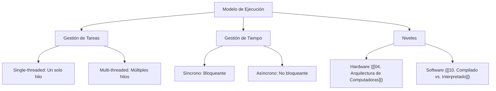
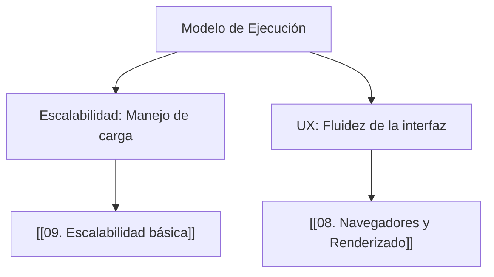

---
aliases:
  - Execution Models
  - Ciclo de Ejecución
tags:
  - modelos_de_ejecucion
  - runtime
  - arquitectura_software
  - flujo_de_instrucciones
  - fundamentos
created: 2026-02-18 20:30
modified: 2026-02-23 17:23
rating: 4
nivel: 2
fuentes:
  - "Computer Systems: A Programmer's Perspective - Bryant & O'Hallaron"
  - Modern Operating Systems - Andrew Tanenbaum
estado: pendiente
---
# 09. Modelos de Ejecución

> [!abstract]+ Resumen
> **Idea Principal**: Un **Modelo de Ejecución** define la manera en que un sistema computacional organiza y procesa las instrucciones de un programa. No se trata solo de "correr el código", sino de la arquitectura lógica (Runtime) que gestiona cómo se asignan los recursos y se secuencian las tareas.
> **Contexto**: Para un ING. Software, entender esto es vital para diagnosticar problemas de concurrencia, latencia y uso de memoria. Determina si tu código se ejecuta de forma lineal, paralela o basada en eventos.

## 🎯 **Concepto Clave**
**Definición**: Es el marco de trabajo que describe la relación entre el flujo de instrucciones y el flujo de datos. Define el "contrato" entre el software y el hardware (o la máquina virtual).

Los modelos más comunes en el desarrollo moderno son:
1.  **Síncrono / Secuencial**: Una tarea debe terminar para que empiece la siguiente.
2.  **Asíncrono**: Las tareas pueden iniciarse y completarse de forma independiente al flujo principal (ver [[10. Programación Asíncrona]] en Web).
3.  **Basado en Eventos (Event-Driven)**: El flujo es determinado por mensajes o acciones del usuario/sistema (común en Node.js y UIs).
4.  **Paralelo**: Múltiples instrucciones se ejecutan exactamente al mismo tiempo en diferentes núcleos (ver [[05. Concurrencia y Paralelismo]] en Sistemas).

> [!tip] TL;DR para Humanos:
> Imagina una cocina:
> - **Secuencial**: El chef pica la cebolla, *luego* la fríe, *luego* sirve. Una cosa a la vez.
> - **Asíncrono**: El chef pone el agua a hervir y, *mientras espera*, pica la cebolla. No se queda mirando la olla sin hacer nada.

##### 💻 **Implementación / Ejemplo**


```markdown
##### Ejemplo genérico
- Modelo Batch: Procesa todos los datos juntos al final.
- Modelo Real-time: Procesa datos tan pronto como llegan.
```


##### **Fórmula/Key Metric**: `Ciclo de Instrucción (Fetch-Decode-Execute)`
```text
1. Fetch: Recuperar instrucción de memoria.
2. Decode: Traducir instrucción.
3. Execute: Ejecutar en la ALU/Unidad de Control.
```

## 🔍 **Mapa del Concepto**


## 🔍 **¿Por qué importa?**


## 📋 **Propiedades Clave**
| Aspecto        | Detalle                               |
| -------------- | ------------------------------------- |
| Complejidad    | alta                                  |
| Uso frecuente  | esencial                              |
| Complejidad (Big-O)| N/A (Impacto sistémico)           |
| Prerequisitos  | [[08. Pensamiento Algorítmico]]       |
| MOC Padre      | [[00_MOC Fundamentos]]                |

## ⚠️ Errores Comunes
- **Confundir Asincronía con Paralelismo**: La asincronía trata de *esperar* de forma inteligente; el paralelismo trata de *hacer* varias cosas a la vez.
- **Bloquear el Event Loop**: Realizar cálculos pesados en un modelo de un solo hilo (como JS), dejando la aplicación "congelada".

## 💡 Intuición
Es como el sistema de turnos en un banco. ¿Hay una sola fila para todos los trámites? (Secuencial). ¿Hay un asesor para cada cliente? (Paralelo). ¿Te dan un ticket y te sientas hasta que te llamen mientras haces otras cosas en tu móvil? (Asíncrono/Event-driven).

## 🔗 **Conexiones**
- **Entrada**: [[08. Pensamiento Algorítmico]] → La lógica que queremos ejecutar.
- **Salida**: [[10. Compilado vs. Interpretado]] → Cómo se traduce ese modelo a la máquina.
- **Hermanos**: [[05. Concurrencia y Paralelismo]], [[02. Stack vs. Heap (Control de Memoria Profunda)]].

## 🧩 Pregunta típica de entrevista
- **¿Qué significa que un modelo sea "Non-blocking"?** - *Respuesta*: Significa que el hilo de ejecución principal no se queda esperando a que una operación de entrada/salida (I/O) termine, sino que continúa con otras tareas y procesa el resultado de la operación original mediante un callback o promesa cuando está listo.

## 🛠 Laboratorio (Active Recall)
- [ ] **Explicación Feynman**: ¿Puedo explicar cómo funciona el ciclo Fetch-Decode-Execute sin usar palabras técnicas?
- [ ] **Flashcard**: ¿Cuál es la diferencia entre un proceso y un hilo (thread)?
- [ ] **Prueba de Código**: Crear un ejemplo de asincronía en [[Laboratorio]] y explicar el orden de ejecución.

## 🚀 **Siguiente Acción**
- **Leer**: "Modern Operating Systems" de Tanenbaum, sección sobre Procesos e Hilos.
- **Explorar**: Cómo cambia el modelo de ejecución al pasar de un lenguaje interpretado a uno compilado en [[10. Compilado vs. Interpretado]].

## 📚 **Fuentes**
1. Bryant, R. E., & O'Hallaron, D. R. (2015). *Computer Systems: A Programmer's Perspective*.
2. Tanenbaum, A. S. (2014). *Modern Operating Systems*.

---
**¿Te gustaría profundizar en cómo el procesador gestiona esto físicamente en [[04. Arquitectura de Computadoras]] o pasamos a [[10. Compilado vs. Interpretado]]?**
