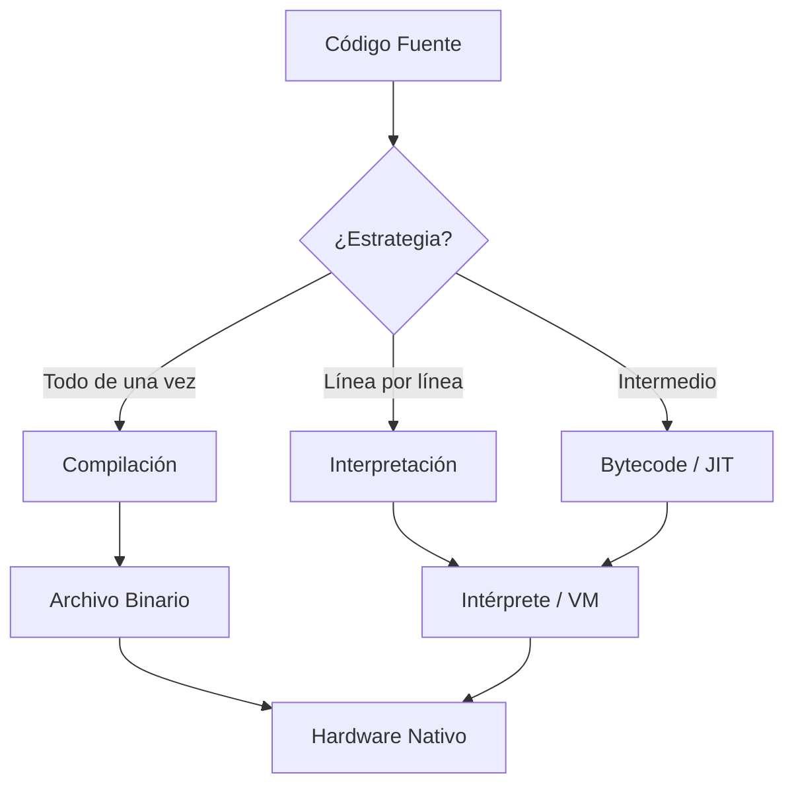
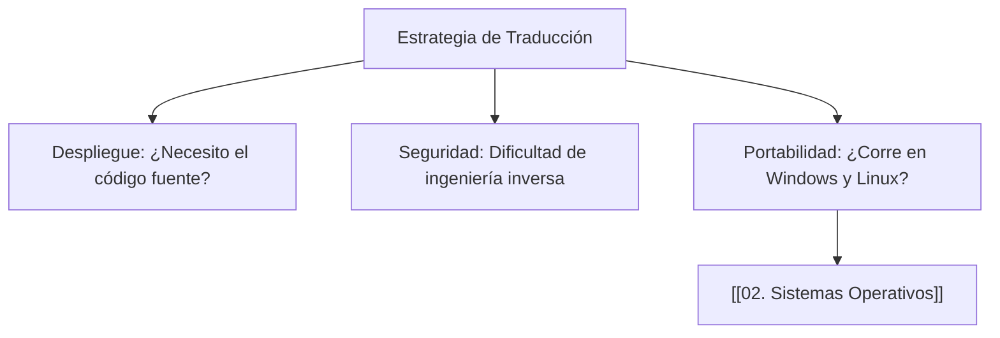

---
aliases:
  - Estrategias de Traducción
  - Compiled vs Interpreted
tags:
  - compilacion
  - interpretacion
  - performance
  - ciclo_de_vida_codigo
  - fundamentos
created: 2026-02-18 20:30
modified: 2026-02-23 17:23
rating: 5
nivel: 2
fuentes:
  - "Compilers: Principles, Techniques, and Tools - Aho et al."
  - Programming Language Pragmatics - Michael L. Scott
estado: estudiando
---
# 10. Compilado vs. Interpretado

> [!abstract]+ Resumen
> **Idea Principal**: Los lenguajes de programación se transforman en lenguaje máquina de dos formas principales: **Compilación** (traducción previa y total) e **Interpretación** (traducción línea a línea durante la ejecución).
> **Contexto**: Un ING. Software debe elegir entre ellos basándose en el balance necesario entre **rendimiento de ejecución** y **flexibilidad de desarrollo**.

## 🎯 **Concepto Clave**
**Definición**: Es el método por el cual el código fuente (legible por humanos) se convierte en código objeto (ejecutable por el hardware).

1. **Compilados (C, C++, Rust)**: Un programa llamado **Compilador** lee todo el código y genera un archivo binario independiente. 
2. **Interpretados (Python, Ruby, PHP)**: Un programa llamado **Intérprete** lee el código y lo ejecuta al vuelo.
3. **Híbridos (Java, C#, JS)**: El código se compila a un paso intermedio (**Bytecode**) que luego es ejecutado por una Máquina Virtual (JVM) o un motor con compilación **JIT (Just-In-Time)**.

> [!tip] TL;DR para Humanos:
> - **Compilado**: Es como traducir un libro entero antes de venderlo. El lector lo lee rápido, pero si cambias una frase, debes re-imprimir todo el libro.
> - **Interpretado**: Es como tener un traductor en vivo. Puedes cambiar el discurso sobre la marcha, pero el proceso es más lento porque hay que traducir palabra por palabra mientras hablas.

##### 💻 **Implementación / Ejemplo**


```markdown
##### Ejemplo genérico de flujo
- Compilado: Código Fuente -> Compilador -> Binario (.exe/.out) -> Ejecución
- Interpretado: Código Fuente -> Intérprete -> Ejecución
```


##### **Fórmula/Key Metric**: `Trade-off del Performance`
```text
Compilados: + Velocidad de ejecución | - Tiempo de desarrollo (compilación lenta)
Interpretados: - Velocidad de ejecución | + Flexibilidad (multiplataforma, debug rápido)
```

## 🔍 **Mapa del Concepto**


## 🔍 **¿Por qué importa?**


## 📋 **Propiedades Clave**
| Aspecto        | Compilado               | Interpretado            |
| -------------- | ----------------------- | ----------------------- |
| Velocidad      | Alta                    | Media/Baja              |
| Errores        | Detectados antes (AOT)  | Detectados en Runtime   |
| Portabilidad   | Específica de CPU/SO    | Alta (vía Intérprete)   |
| MOC Padre      | [[00_MOC Fundamentos]]  |                         |

## ⚠️ Errores Comunes
- **Creer que un lenguaje es "puramente" uno u otro**: Muchos lenguajes modernos usan técnicas de ambos (como el JIT de JavaScript).
- **Asumir que interpretado siempre es lento**: Para muchas tareas de red o E/S, la diferencia es despreciable.

## 💡 Intuición
Imagina que quieres armar un mueble de IKEA. 
- **Compilado**: Viene un experto, lo arma todo y te lo entrega listo. Tú solo lo usas.
- **Interpretado**: Tú vas leyendo las instrucciones paso a paso mientras intentas poner cada tornillo.

## 🔗 **Conexiones**
- **Entrada**: [[09. Modelos de Ejecución]] → El marco donde ocurre la traducción.
- **Salida**: [[11. LENGUAJES]] → Donde aplicarás este conocimiento para elegir una herramienta.
- **Hermanos**: [[04. Arquitectura de Computadoras]], [[01. Anatomía de la Programación]].

## 🧩 Pregunta típica de entrevista
- **¿Qué es la compilación JIT (Just-In-Time)?** - *Respuesta*: Es un híbrido que compila partes del código a lenguaje máquina justo antes de ejecutarlas (en tiempo de ejecución) basándose en qué partes se usan más, combinando la velocidad de los compilados con la flexibilidad de los interpretados.

## 🛠 Laboratorio (Active Recall)
- [ ] **Explicación Feynman**: Explicar por qué un programa compilado en Windows no corre nativamente en un Mac (aunque el código sea el mismo).
- [ ] **Flashcard**: ¿Qué es un archivo `.pyc` o un `.class`? (Respuesta: Bytecode intermedio).
- [ ] **Prueba de Código**: Comparar el tiempo de ejecución de un bucle de 1 millón de iteraciones en Python vs. C++.

## 🚀 **Siguiente Acción**
- **Leer**: "Compilers: Principles, Techniques, and Tools" (The Dragon Book), Capítulo 1.
- **Explorar**: Cómo funciona el motor V8 en [[08. Navegadores y Renderizado]].

## 📚 **Fuentes**
1. Aho, A. V., et al. (2006). *Compilers: Principles, Techniques, and Tools*.
2. Scott, M. L. (2016). *Programming Language Pragmatics*.

---
**¿Quieres que analicemos cómo la CPU procesa esto a nivel de registros en [[04. Arquitectura de Computadoras]] o hemos terminado con la rama de Fundamentos?**
