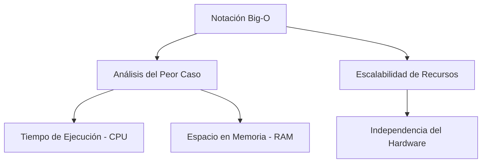
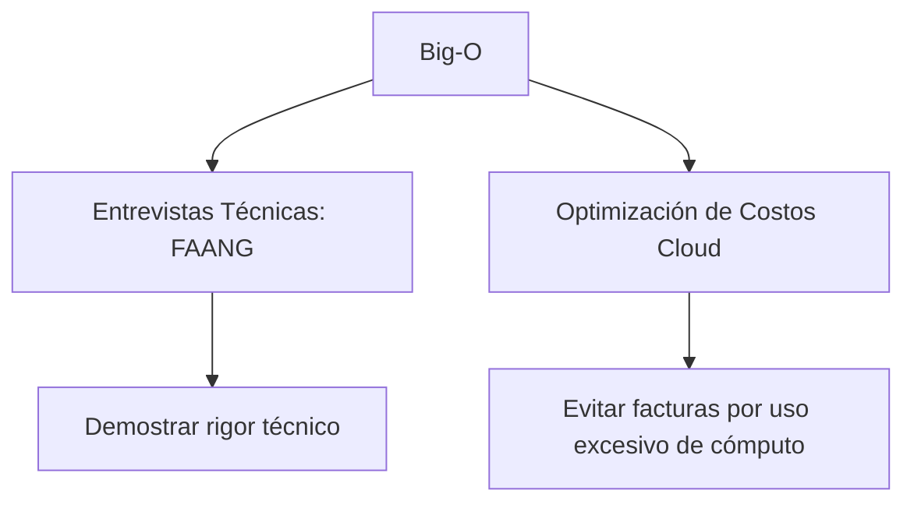

---
aliases:
  - Big-O
  - Complejidad Asintótica
  - Eficiencia Algorítmica
tags:
  - algoritmia
  - análisis_asintótico
  - rendimiento_software
  - computer_science
created: 2026-02-23 23:51
modified: 2026-02-24 09:08
rating: 5
nivel: 3
fuentes:
  - Introduction to Algorithms (CLRS)
  - The Algorithm Design Manual (Skiena)
estado: pendiente
---

# 12. Notación Big-O

> [!abstract]+ Resumen
> **Idea Principal**: La Notación Big-O es un lenguaje matemático utilizado para describir el límite superior del tiempo de ejecución o el uso de memoria de un algoritmo en función del tamaño de la entrada ($n$). Es el estándar para medir la escalabilidad, no el tiempo exacto.
> **Contexto**: Para un ING. Software, es la herramienta fundamental para predecir si una solución colapsará bajo carga real antes de escribir una sola línea de código, permitiendo elegir la arquitectura adecuada según los **límites físicos** del sistema.

## 🎯 **Concepto Clave**
**Definición**: Formalmente, se dice que $f(n) = O(g(n))$ si existen constantes positivas $c$ y $n_0$ tales que $0 \le f(n) \le c \cdot g(n)$ para todo $n \ge n_0$. En términos de ingeniería, representa el **peor caso** (worst-case scenario), garantizando que el algoritmo nunca será más lento que dicha cota.

A nivel de **arquitectura**, Big-O nos permite entender la degradación del rendimiento: ¿Es el crecimiento lineal, logarítmico o exponencial? Esta distinción separa un sistema que soporta 1,000 usuarios de uno que soporta 1,000,000.

> [!tip] TL;DR para Humanos:
> Es como comparar medios de transporte: no importa si el coche es rojo o azul, lo que importa es que un avión siempre será más rápido para cruzar el océano, y una bicicleta siempre será más lenta. Big-O clasifica "aviones", "coches" y "bicis" de código.

##### 💻 **Implementación / Ejemplo**

```markdown

##### Ejemplo conceptual de Crecimiento
- O(1): Acceso a un índice de array.
- O(log n): Búsqueda binaria en una lista ordenada.
- O(n): Recorrer una lista simple.
- O(n log n): Algoritmos de ordenamiento eficientes (Merge Sort).
- O(n²): Bucles anidados simples (Bubble Sort).
```

![[2025-big-o-notation.png]]

##### **Fórmula/Key Metric**: `Crecimiento Asintótico`
```markdown

f(n) ≤ c * g(n)
```

## 🔍 **Mapa del Concepto**


## 🔍 **¿Por qué importa?**


## 📋 **Propiedades Clave**
| Aspecto       | Detalle              |
| ------------- | -------------------- |
| Complejidad   | Alta (Teórica)       |
| Uso frecuente | Esencial             |
| Complejidad (Big-O)| N/A (Es la métrica) |
| Prerequisitos | [[08. Pensamiento Algorítmico]], [[07. Matemática para Algoritmos]] |
| MOC Padre     | [[01_MOC Computer Science]] |

## ⚠️ Errores Comunes
- **Ignorar constantes en sistemas pequeños**: A veces un $O(n^2)$ es más rápido que un $O(n)$ si $n$ es muy pequeño debido a la sobrecarga inicial (**overhead**).
- **Confundir Big-O con tiempo real**: Big-O mide pasos lógicos, no milisegundos.
- **Asumir que siempre es el Peor Caso**: Aunque se usa así habitualmente, Big-O es técnicamente un límite superior. El promedio se describe con $\theta$ (Theta).

## 💡 Intuición
Imagina que tienes que limpiar una habitación.
- **O(1)**: Solo tienes que apagar la luz. No importa qué tan grande sea la habitación, tardas lo mismo.
- **O(n)**: Tienes que aspirar el suelo. Si la habitación es el doble de grande, tardas el doble.
- **O(n²)**: Tienes que comparar cada baldosa con todas las demás para ver si combinan. Si hay 10 baldosas, haces 100 comparaciones. ¡Esto se sale de control rápido!

## 🔗 **Conexiones**
- **Entrada**: [[11. Complejidad Algorítmica]] → Esta nota
- **Salida**: Esta nota → [[13. Algoritmos de Ordenamiento]]
- **Hermanos**: [[02. Recursión]], [[14. Búsqueda]]

## 🧩 Pregunta típica de entrevista
- "Tu algoritmo actual es $O(n^2)$ y tarda 1 segundo para 1,000 elementos. ¿Cuánto tardará aproximadamente para 1,000,000 de elementos y cómo podrías bajarlo a $O(n \log n)$?"

## 🛠 Laboratorio (Active Recall)
[ ] Explicación Feynman: ¿Puedo explicar por qué $O(2n + 10)$ se simplifica a $O(n)$?
[ ] Flashcard: ¿Cuál es la diferencia entre complejidad temporal y espacial?
[ ] Prueba de Código: Implementado en [[Laboratorio]] (Comparativa de búsqueda lineal vs binaria).

## 🚀 **Siguiente Acción**
- **Leer**: *Introduction to Algorithms* (CLRS) Capítulo 3: Growth of Functions.
- **Hacer**: Identificar la complejidad de un script propio en la carpeta [[11_LENGUAJES]].

## 📚 **Fuentes**
1. Cormen, T. H., Leiserson, C. E., Rivest, R. L., & Stein, C. (2009). *Introduction to Algorithms*. MIT Press.
2. Skiena, S. S. (2020). *The Algorithm Design Manual*. Springer.
