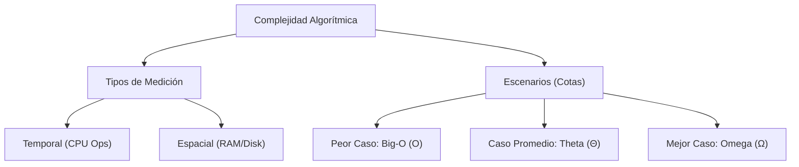
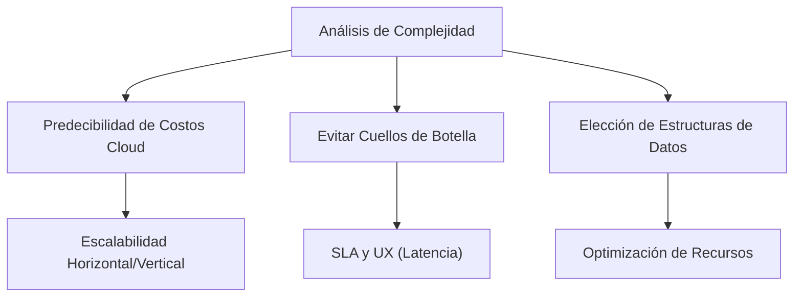

# 12. Complejidad Algorítmica

> [!abstract]+ Resumen
> **Idea Principal**: La complejidad algorítmica es la métrica teórica que define cómo escalan los recursos necesarios (tiempo y espacio) de un algoritmo a medida que el tamaño de la entrada ($n$) tiende al infinito.
> **Contexto**: Para un ING. Software, no se trata solo de que el código "funcione", sino de predecir su viabilidad técnica en entornos de producción con datos masivos y límites de infraestructura.

## 🎯 **Concepto Clave**
**Definición**: Es el estudio formal de la eficiencia de los algoritmos. Se centra en establecer cotas matemáticas que describen el comportamiento asintótico de una función de coste. A diferencia del benchmarking (medir segundos), la complejidad analiza el crecimiento teórico independiente del hardware.

> [!tip] TL;DR para Humanos:
> Es como planear una mudanza: no importa cuánto pesen las cajas hoy, sino cuánto más vas a tardar y cuántos camiones extra necesitarás si en lugar de una habitación, tienes que mudar un edificio entero.

##### 💻 **Implementación / Ejemplo**


##### *Ejemplo genérico: Impacto del crecimiento*
- **Algoritmo A**: $10n$ (Lineal) -> Para $n=10^6$, tarda $10^7$ ops.
- **Algoritmo B**: $n^2$ (Cuadrático) -> Para $n=10^6$, tarda $10^{12}$ ops.

La diferencia es la viabilidad del sistema.


##### **Fórmula/Key Metric**: `Ecuación General de Coste`
```latex
T(n) = f(n)
```
Donde $n$ es el tamaño de la entrada y $f(n)$ es la función de crecimiento.

## 🔍 **Mapa del Concepto**


## 🔍 **¿Por qué importa?**


## 📋 **Propiedades Clave**
| Aspecto       | Detalle              |
| ------------- | -------------------- |
| Complejidad   | Alta (Teórica)       |
| Uso frecuente | Esencial             |
| Complejidad (Big-O)| Variable según algoritmo |
| Prerequisitos | [[08. Pensamiento Algorítmico]], [[08. Análisis básico de crecimiento]] |
| MOC Padre     | [[01_MOC Computer Science]] |

### 1. Tipos de Complejidad (El qué)
* **Complejidad Temporal**: Mide el número de instrucciones ejecutadas. No usamos milisegundos porque dependen del procesador; usamos unidades de tiempo lógico.
* **Complejidad Espacial**: Evalúa la memoria RAM adicional que el algoritmo requiere. Incluye el espacio de la pila de llamadas (importante en [[22. Recursión]]) y el espacio de datos auxiliares. En sistemas de **Datos masivos**, suele ser el factor limitante antes que el tiempo.

### 2. Los Tres Escenarios (El cuándo)
* **Peor Caso ($O$ - Big-O)**: El límite superior. Es el estándar de la industria porque garantiza que el sistema no se comportará peor que esto. Fundamental para [[13. Estimación de Costos y Tiempos]].
* **Caso Promedio ($\Theta$ - Theta)**: Describe el comportamiento esperado en una distribución de datos normal. Es la métrica más realista para el *rendimiento en producción*.
* **Mejor Caso ($\Omega$ - Omega)**: El límite inferior. Es útil para identificar algoritmos que son "fáciles" de resolver para ciertas entradas (ej. un array ya ordenado).

### 3. Factores Determinantes
* **Iteraciones**: Los bucles anidados multiplican la complejidad ($n \cdot n$).
* **Profundidad de Recursión**: Afecta directamente a la **Stack** de memoria física ([[02. Stack vs. Heap (Control de Memoria Profunda)]]).
* **Costo de Operaciones**: Las operaciones aritméticas son $O(1)$, pero el acceso a disco o consultas a **Bases de Datos** tienen costos latentes que alteran la constante de la función.

## ⚠️ Errores Comunes
- **Ignorar el Espacio**: Optimizar el tiempo a costa de colapsar la memoria física ([[04. Arquitectura de Computadoras]]).
- **Confundir O con $\Theta$**: Usar Big-O para describir el caso promedio cuando solo es una cota superior.
- **No considerar la Localidad de Referencia**: A veces un algoritmo $O(n \log n)$ es más lento que un $O(n^2)$ para $n$ pequeñas debido al **Cache Miss**.

## 💡 Intuición
Imagina que estás organizando una biblioteca. Si para encontrar un libro tienes que leer todos los lomos uno por uno, tu tiempo crece linealmente con los libros. Si la biblioteca duplica su tamaño, tardas el doble. Si usas un índice (como una **Tabla Hash**), tardas lo mismo sin importar si hay 10 o 10,000 libros. Eso es entender la complejidad.

## 🔗 **Conexiones**
- **Entrada**: [[08. Pensamiento Algorítmico]] → Esta nota
- **Salida**: Esta nota → [[16. Notación Big-O]]
- **Hermanos**: [[07. Abstracción]], [[08. Análisis básico de crecimiento]]

## 🧩 Pregunta típica de entrevista
- "¿Por qué un algoritmo con mejor complejidad asintótica podría ser más lento en la práctica para conjuntos de datos pequeños?"
    - *Respuesta*: Debido a las **Constantes Ocultas** y la **Jerarquía de Memoria** (overhead de inicialización y gestión de caché).

## 🛠 Laboratorio (Active Recall)
- [ ] Explicación Feynman: Explicar por qué la recursión aumenta la complejidad espacial.
- [ ] Flashcard: ¿Cuál es la diferencia entre $O(n)$ y $\Omega(n)$?
- [ ] Prueba de Código: Comparar tiempos de ejecución en [[Laboratorio]] entre una búsqueda lineal y una binaria con $n=10^7$.

## 🚀 **Siguiente Acción**
- **Leer**: "Introduction to Algorithms" (Cormen), Capítulo 3: Growth of Functions.
- **Hacer**: Ejercicios de cálculo de complejidad en bucles anidados.

## 📚 **Fuentes**
1. [Cormen, T. H. - Introduction to Algorithms](https://mitpress.mit.edu/9780262046305/introduction-to-algorithms/)
2. [Sedgewick, R. - Algorithms](https://algs4.cs.princeton.edu/home/)
