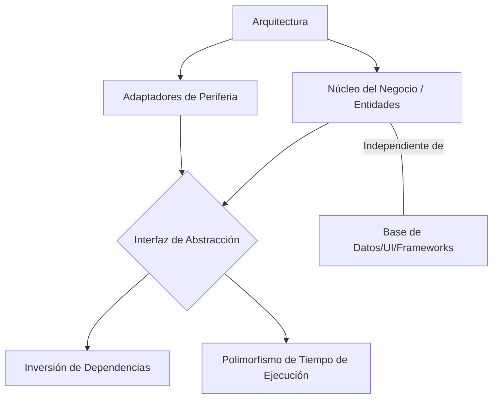
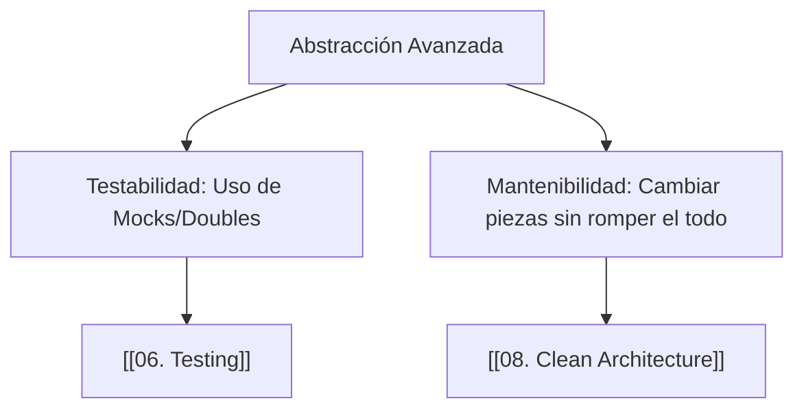

---
aliases:
  - Polimorfismo
  - Interfaces
  - Inyección de Dependencias
tags:
  - patrones_diseño
  - arquitectura_sistemas
  - desacoplamiento
  - abstracción
  - abstraccion_avanzada
created: 2026-02-18 20:37
modified: 2026-02-23 17:06
rating: 5
nivel: 3
fuentes:
  - Design Patterns - Gang of Four
  - Clean Architecture - Robert C. Martin
estado: pendiente
---
> [!info] Para Borrar después:
> **aliases:** Búsquedas alternativas
> **tags:** Filtros Dataview/Gráficos
> **created/modified:** Historial de cambios
> **rating:** Prioridad personal (1-5 ⭐)
>  1. Curiosidad / Contexto
>  2. Útil pero no crítico
>  3. Importante
>  4. Muy importante
>  5. Fundamento absoluto
>**nivel:** 1=Crudo, 2=Explicado bien, 3=Profundizado
>**fuentes:** Referencias
>estado: no terminado/pendiente/estudiando/dominado


# 05. Abstracción Avanzada

> [!abstract]+ Resumen
> **Idea Principal**: La **Abstracción Avanzada** trasciende la simple ocultación de funciones para enfocarse en la creación de **contratos (Interfaces/Clases Abstractas)** y el desacoplamiento total entre componentes mediante la inversión de control.
> **Contexto**: Es la base de la arquitectura empresarial. Permite que un sistema sea agnóstico a los detalles (como qué base de datos usa o qué framework de UI tiene), facilitando la extensibilidad sin modificar el núcleo del negocio.

## 🎯 **Concepto Clave**
**Definición**: A nivel arquitectónico, la abstracción no es solo una herramienta de legibilidad, sino un mecanismo de **desacoplamiento**. Se implementa mediante:
1.  **Interfaces/Protocolos**: Definición pura de comportamiento sin implementación.
2.  **Inversión de Dependencias (DIP)**: Los módulos de alto nivel no dependen de los de bajo nivel; ambos dependen de abstracciones.
3.  **Polimorfismo**: La capacidad de tratar diferentes tipos de objetos a través de una interfaz común.

> [!tip] TL;DR para Humanos:
> Es como el **puerto USB** de tu laptop. La laptop (sistema de alto nivel) no sabe si vas a conectar un teclado, un ventilador o un disco duro. Solo conoce el "contrato" USB. Mientras lo que conectes cumpla con la forma del puerto, funcionará.

##### 💻 **Implementación / Ejemplo**

```markdown

##### Ejemplo Arquitectónico
Componente UI --> [ Interfaz DataService ] <-- Implementación MySQL
                                          <-- Implementación API Rest
```


##### **Fórmula/Key Metric**: `Estabilidad de la Abstracción`
```text

I = Ce / (Ca + Ce)
(Donde Ce es eferentes y Ca aferentes. 
Mide qué tan dependiente es un componente de otros).
```

## 🔍 **Mapa del Concepto**



## 🔍 **¿Por qué importa?**


## 📋 **Propiedades Clave**
| Aspecto        | Detalle                               |
| -------------- | ------------------------------------- |
| Complejidad    | alta                                  |
| Uso frecuente  | común en frameworks/sistemas grandes  |
| Complejidad (Big-O)| N/A (Impacto en Diseño)            |
| Prerequisitos  | [[07. Abstracción]], [[09. Principios SOLID]] |
| MOC Padre      | [[05_MOC Arquitectura]]               |

## ⚠️ Errores Comunes
- **Interfaz "Gorda"**: Crear interfaces con demasiados métodos (viola **Interface Segregation**).
- **Abstracción Especulativa**: Crear interfaces "por si acaso" cuando solo hay una implementación real (YAGNI).
- **Costo de Indirección**: Demasiadas capas de abstracción pueden dificultar el seguimiento del flujo de ejecución para un humano.

## 💡 Intuición
Imagina que construyes una casa donde las bombillas no están soldadas a los cables, sino que usan un **zócalo estándar**. El zócalo es la abstracción avanzada: permite cambiar una bombilla LED por una inteligente sin cambiar el cableado de la casa.

## 🔗 **Conexiones**
- **Entrada**: [[07. Abstracción]] → Concepto base de simplificación.
- **Salida**: [[08. Clean Architecture]] → Aplicación global de estas capas.
- **Hermanos**: [[09. Principios SOLID]], [[04. Acoplamiento y Cohesión]].

## 🧩 Pregunta típica de entrevista
- **¿Cuál es la diferencia entre una Clase Abstracta y una Interfaz?** - *Respuesta*: Una clase abstracta puede tener implementación parcial y estado (campos), mientras que una interfaz (en su forma pura) es solo un contrato de comportamiento. Se usa Clase Abstracta para "es un" y Interfaz para "puede hacer".

## 🛠 Laboratorio (Active Recall)
- [ ] **Explicación Feynman**: ¿Puedo explicar cómo la Inversión de Dependencias protege mi lógica de negocio de cambios en la base de datos?
- [ ] **Flashcard**: ¿Qué es el "Dependency Hell" y cómo lo soluciona la inyección de dependencias?
- [ ] **Prueba de Diseño**: En [[Laboratorio]], diseña un sistema de logs que pueda enviar a Consola, Archivo o Nube sin cambiar la lógica del programa principal.

## 🚀 **Siguiente Acción**
- **Hacer**: Revisar un controlador en tu código y aplicar **Inyección de Dependencias** para extraer la lógica de persistencia.
- **Leer**: "Clean Architecture" de Uncle Bob, Capítulos sobre los principios de componentes.

## 📚 **Fuentes**
1. Martin, R. C. (2017). *Clean Architecture*.
2. Gamma, E., et al. (1994). *Design Patterns*.

---
**¿Te gustaría que apliquemos esto específicamente al patrón [[07. MVC]] o que pasemos a los [[09. Principios SOLID]]?**
