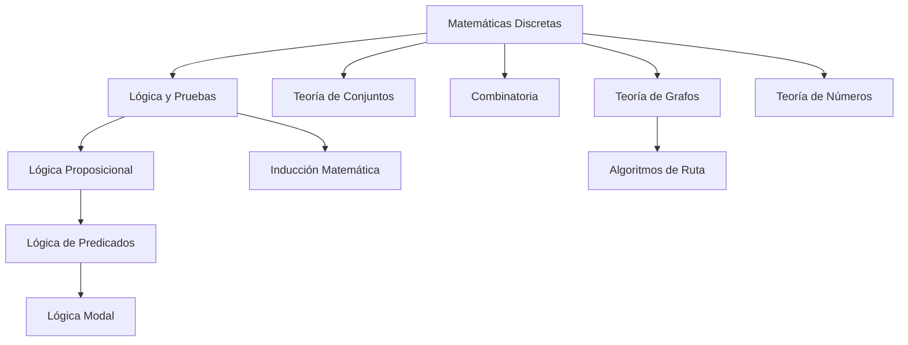
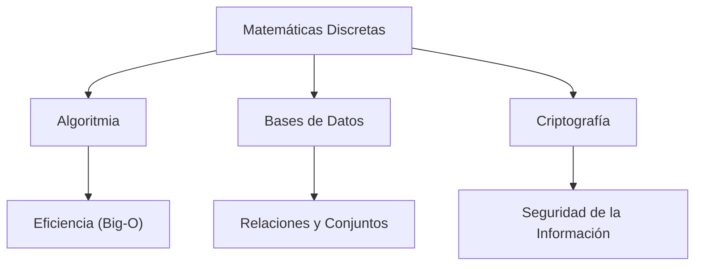

---
aliases:
  - Estructuras Discretas
  - Fundamentos Matemáticos de CS
tags:
  - matematicas_discretas
  - teoria_de_la_computacion
  - cs-theory
  - matemáticas
created: 2026-02-19 08:54
modified: 2026-03-04 23:47
rating: 4
nivel: 2
fuentes:
  - Discrete Mathematics and Its Applications (Kenneth Rosen)
  - Concrete Mathematics (Knuth)
estado: estudiando
---
> [!info] Para Borrar después:
> **aliases:** Búsquedas alternativas
> **tags:** Filtros Dataview/Gráficos
> **created/modified:** Historial de cambios
> **rating:** Prioridad personal (1-5 ⭐)
>  1. Curiosidad / Contexto
>  2. Útil pero no crítico
>  3. Importante
>  4. Muy importante
>  5. Fundamento absoluto
>**nivel:** 1=Crudo, 2=Explicado bien, 3=Profundizado
>**fuentes:** Referencias
>estado: no terminado/pendiente/estudiando/dominado

# 01. Matemática Discreta

> [!abstract]+ Resumen
> **Idea Principal**: Estudio de estructuras matemáticas que son fundamentalmente discretas (contables y separadas) en lugar de continuas. Es el lenguaje matemático sobre el cual se construye toda la computación moderna.
> **Contexto**: Para un ING. Software, es la base de todo: desde la lógica de un `if`, pasando por la optimización de bases de datos, hasta la complejidad de los algoritmos que escribimos.

## 🎯 **Concepto Clave**
**Definición**: Las matemáticas discretas se encargan de objetos que solo pueden tomar valores distintos y separados. A diferencia del cálculo (que es continuo), aquí trabajamos con números enteros, grafos, y proposiciones lógicas. Si el mundo físico parece analógico, el mundo del software es puramente discreto.

> [!tip] TL;DR para Humanos:
> Es la matemática de los pasos. Mientras el cálculo es como una rampa (suave y continua), la matemática discreta es como una escalera (vas escalón por escalón, no hay puntos medios).

##### 💻 **Implementación / Ejemplo**
```js

// La discretización en la práctica: Bucles y Colecciones
// No puedes iterar 1.5 veces un array; es 1 o es 2.

const elementos = [1, 2, 3]
elementos.forEach(e => console.log(e))
```

##### **Fórmula/Key Metric**: `Cardinalidad de Conjuntos Finitos`
$$|A \cup B| = |A| + |B| - |A \cap B|$$

Esta fórmula sirve para *contar elementos de conjuntos unidos sin repetir los que tienen en común*.

1. $|A| + |B|$: Sumas todo lo que hay en el grupo A y todo lo que hay en el grupo B.
2. $- |A \cap B|$: Restas una vez lo que está en ambos (la intersección).

*¿Por qué se resta?* Porque al sumar A y luego sumar B, los elementos que están en el medio los has contado dos veces. Si no los restas, el resultado es mentira.

## 🔍 **Mapa del Concepto**


## 🔍 **¿Por qué importa?**


## 📋 **Propiedades Clave**
| Aspecto       | Detalle              |
| ------------- | -------------------- |
| Complejidad   | Variable (Base de CS) |
| Uso frecuente | Esencial / Ubicuo    |
| Complejidad (Big-O)| N/A (Marco Teórico)   |
| Prerequisitos | Álgebra Básica       |
| MOC Padre     | [[10_MOC Matemáticas]] |

## ⚠️ Errores Comunes
- **Pensar en Continuo:** Tratar de aplicar conceptos de límites o derivadas donde solo existen pasos finitos.
- **Subestimar la Lógica:** Creer que la lógica es "sentido común" cuando requiere un rigor simbólico estricto para evitar bugs.

## 💡 Intuición
Imagina que estás construyendo con piezas de LEGO. No puedes tener "media pieza" de 2x4. O pones la pieza o no la pones. Las Matemáticas Discretas son las reglas que te dicen cómo esas piezas individuales pueden encajar para formar estructuras complejas como un castillo (un software).

## 🔗 **Conexiones**
- **Entrada**: [[00_MOC Fundamentos]] → La necesidad de reglas para computar.
- **Salida**: Esta nota → [[02. Lógica Proposicional]], [[04. Teoría de Conjuntos]], [[06. Grafos]].
- **Hermanos**: [[08. Matemática para Algoritmos]].

## 🧩 Pregunta típica de entrevista
- **¿Por qué un ingeniero de software debe estudiar matemáticas discretas si los lenguajes ya manejan la lógica?**
  *Respuesta*: Porque los lenguajes son solo herramientas. La matemática discreta te permite modelar el problema (ej. usar grafos para redes sociales) y predecir si tu solución escalará antes de escribir una sola línea de código.

## 🛠 Laboratorio (Active Recall)
- [x] Explicación Feynman: ¿Puedo explicar la diferencia entre discreto y continuo?
- [ ] Flashcard: ¿Cuáles son las 4 ramas principales de la matemática discreta aplicadas a CS?
- [ ] Prueba de Código: Implementar un algoritmo de búsqueda simple en el [[Laboratorio]].

## 🚀 **Siguiente Acción**
- **Leer**: Capítulo 1 de Rosen (Introducción a la Lógica).
- **Hacer**: Identificar 3 estructuras discretas en tu proyecto actual.

## 📚 **Fuentes**
1. [Discrete Mathematics and Its Applications - Kenneth Rosen](https://www.mheducation.com/highered/product/discrete-mathematics-its-applications-rosen/M9781259676512.html)
2. [Concrete Mathematics: A Foundation for Computer Science - Ronald Graham, Donald Knuth](https://www-cs-faculty.stanford.edu/~knuth/gkp.html)

