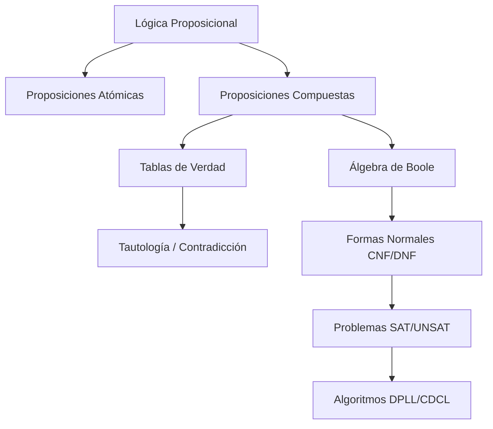
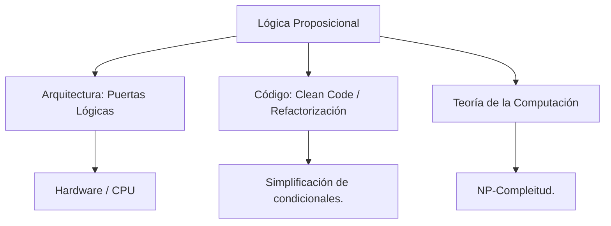

---
aliases:
  - Lógica Simbólica
  - Cálculo Proposicional
  - Cálculo de Enunciados
tags:
  - logica_booleana
  - fundamentos_matematicos
  - demostraciones
  - matemáticas
  - cs-theory
created: 2026-02-19 08:54
modified: 2026-03-01 19:26
rating: 5
nivel: 3
fuentes:
  - Discrete Mathematics and Its Applications (Rosen)
  - Mathematical Logic for Computer Science (Mordechai Ben-Ari)
estado: dominado
---

# 02. Lógica Proposicional

> [!abstract]+ Resumen
> **Idea Principal**: La Lógica Proposicional es la rama de la lógica que estudia las proposiciones y las formas en que se combinan mediante conectores, evaluando su valor de verdad.
> **Contexto IT**: Para un Ingeniero de Software, es el núcleo de las [[05. Estructuras de Control]] (`if/else`), el diseño de circuitos en [[04. Arquitectura de Computadoras]], la optimización de consultas en bases de datos y el análisis de [[11. Complejidad Algorítmica]].

## 🎯 **Concepto Clave**
**Definición**: Se ocupa de sentencias declarativas (proposiciones) que pueden ser verdaderas o falsas, pero no ambas. A diferencia de la lógica de predicados, aquí no analizamos el "sujeto", sino la frase como un bloque atómico.

> [!tip] TL;DR para Humanos:
> Es el sistema de reglas para decidir si una frase compuesta es verdad o mentira basándose solo en sus partes. Es como el "álgebra de las palabras".

### 🔡 **Notación y Simbología**
Para representar afirmaciones sin ambigüedades, utilizamos variables proposicionales (usualmente $p, q, r, s$) y conectores lógicos.

| Operación | Símbolo | Uso |
| :--- | :---: | :--- |
| **Negación** | $\neg$ | Invierte el valor de verdad. |
| **Conjunción (Y)** | $\land$ | Verdad solo si ambas partes son verdaderas. |
| **Disyunción (O)** | $\lor$ | Verdad si al menos una parte es verdadera. |
| **Condicional** | $\to$ | Implicación. Falso solo si el primero es cierto y el segundo no. |
| **Bicondicional (XNOR)** | $\iff$ | Verdad solo si ambos tienen el mismo valor. |
| **Disyunción Exclusiva (XOR)** | $\oplus$ | Verdad solo si los valores son distintos. |
| **Verum** | $\top$ | Representa una Tautología (siempre verdadero). |
| **Falsum** | $\bot$ | Representa una Contradicción (siempre falso). |
| **Trinquete** | $\vdash$ | Indica deducción lógica de las premisas. |
| **Conclusión** | $\therefore$ | Indica que una premisa es concluyente según el argumento. |
| **Equivalencia** | $\equiv$ | Indica que dos fórmulas tienen la misma tabla de verdad. |

---

## ⚖️ **Álgebra de Boole y Leyes de Simplificación**
Estas leyes permiten el refactor de lógica compleja, fundamental en [[07. Clean Code]] y [[08. Refactorización]].

1. **Leyes de Morgan**
- **Negación de la Conjunción (Y)**
$$\neg(p \land q) \equiv \neg p \vee \neg q$$
==Se aplica igual sin importar el número de Variables==

- **Negación de la Disyunción (O)**
$$\neg(p \vee q) \equiv \neg p \land \neg q$$
==Se aplica igual sin importar el número de Variables==

2. **Absorción**
- *Estandar*: **Conjunción sobre Disyunción**
$$p \land (p \vee q) \equiv p$$
==No importa cuántas variables hayan en el paréntesis==

- *Estandar*: **Disyunción sobre Conjunción**
$$p \vee (p \land q) \equiv p$$
==No importa cuántas variables hayan en el paréntesis==

- *Estandar*: **Conjunción y Disyunción sobre XNOR**
$$p \land (p \iff q) \equiv p \land q$$
$$p \vee (p \iff q) \equiv p \vee \neg q$$

- *Negación*: **Conjunción sobre Disyunción**
$$p \land(\neg p \lor q) \equiv p \land q$$

- *Negación*: **Disyunción sobre Conjunción**
$$p \lor (\neg p \land q) \equiv p \lor q$$

- *Negación*: **Conjunción y Disyunción sobre XNOR**
$$p \land (\neg p \iff q) \equiv p \land \neg q$$
$$p \vee (\neg p \iff q) \equiv p \vee q$$

3. **Constantes**
- **Dominación (AND)**
$$p \land \bot \equiv \bot$$

- **Identidad (AND)**
$$p \land \top \equiv p$$

- **Dominación (OR)**
$$p \vee \top \equiv \top$$

- **Identidad (OR)**
$$p \vee \bot \equiv p$$

- **Identidad e Inversión (XNOR)**
$$p \iff \top \equiv p$$
$$p \iff \bot \equiv \neg p$$

- **Identidad e Inversión (XOR)**
$$p \oplus \top \equiv \neg p$$
$$p \oplus \bot \equiv p$$

4. **Implicación y Contrapositiva**
- *Implicación*: **Estandar**
$$p \to q \equiv \neg p \vee q$$

- *Implicación*: **Negación**
$$\neg(p \to q) \equiv p \land \neg q$$

- *Implicación*: **Exportación**
$$(p \land q) \to r \equiv p \to (q \to r)$$

- *Contrapositiva*
$$p \to q \equiv \neg q \to \neg p$$

5. **Distributiva**
- *Estandar*: **Conjunción sobre Disyunción**
$$p \land (q \vee r) \equiv (p \land q) \vee (p \land r)$$

- *Estandar*: **Disyunción sobre Conjunción**
$$p \vee (q \land r) \equiv (p \vee q) \land (p \vee r)$$

6. **Idempotencia**
$$p \land p \equiv p$$
$$p \vee p \equiv p$$
$$p \iff p \equiv \top$$
$$p \oplus p \equiv \bot$$

7. **Conmutativas**
$$p \land q \equiv q \land p$$
$$p \vee q \equiv q \vee p$$
$$p \iff q \equiv q \iff p$$
$$p \oplus q \equiv q \oplus p$$

8. **Complemento**
$$p \land \neg p \equiv \bot$$
$$p \vee \neg p \equiv \top$$
$$p \iff \neg p \equiv \bot$$
$$p \oplus \neg p \equiv \top$$

9. **Asociativas**
$$p \land (q \land r) \equiv (p \land q) \land r \equiv p \land q \land r$$
$$p \vee (q \vee r) \equiv (p \vee q) \vee r \equiv p \vee q \vee r$$
$$p \iff (q \iff r) \equiv (p \iff q) \iff r \equiv p \iff q \iff r$$

$$p \oplus (q \oplus r) \equiv (p \oplus q) \oplus r \equiv p \oplus q \oplus r$$

10. **Leyes del Nor-exclusivo (XNOR)**
- **Equivalencias**
$$p \iff q \equiv (p \to q) \land (q \to p)$$
$$p \iff q \equiv (p \land q) \vee (\neg p \land \neg q)$$
$$p \iff q \equiv \neg(p \oplus q)$$

- **Distributiva de Conjunción (AND) sobre XNOR**
$$p \land (q \iff r) \equiv p \land (q \land r) \vee (\neg q \land \neg r)$$
==¡OJO! El AND no se puede distribuir de forma normal porque es un Operador de Paridad, no de agrupación simple==
$$\cancel{p \land (q \iff r) \equiv (p \land q) \iff (p \land r)}$$

- **Distributiva de Disyunción (OR) sobre XNOR**
$$p \vee (q \iff r) \equiv p \vee (q \land r) \land (\neg q \vee \neg r)$$
==¡OJO! El AND no se puede distribuir de forma normal porque es un Operador de Paridad, no de agrupación simple==
$$\cancel{p \vee (q \iff r) \equiv (p \vee q) \iff (p \vee r)}$$

- **XNOR de varias Variables**
$$p \iff q \iff r \iff s ...Siguientes$$
*Devuelve True si el número de falsos es par*

- **Asociación por Bloques**
$$(p \iff q) \iff (r \iff s)$$
*Esto es útil en programación para comparar si dos condiciones de igualdad coinciden entre sí.*

11. **Leyes de la Disyunción Exclusiva (XOR)**
- **Equivalencias**
$$p \oplus q \equiv (p \vee q) \land \neg(p \land q)$$
$$p \oplus q \equiv (\neg p \vee q) \land (p \vee \neg q)$$
$$p \oplus q \equiv \neg(p \iff q)$$

- **Distributiva de Conjunción (AND) sobre XOR**
$$p \land (q \oplus r) \equiv (p \land q) \oplus (p \land r)$$

- **Distributiva de Disyunción (OR) sobre XOR**
$$p \vee (q \oplus r) \equiv p \vee (q \vee r) \land (\neg q \vee \neg r)$$

- **XOR de varias Variables**
$$p \oplus q \oplus r \oplus s ...Siguientes$$
*Devuelve True si el número de verdaderos es impar*

---

## 🏗 **Formas Normales**
Estandarización de fórmulas para procesamiento computacional.

- **CNF (Conjunctive Normal Form)**: Conjunto de disyunciones unidas por conjunciones. Ej: $(p \lor q) \land (r \lor \neg s)$. Se usa en problemas de **SAT**. para encontrar una forma rápida en donde esta fórmula es *Falsa* es sencillo, solo busca el paréntesis con menos cantidad de elementos, adentro busca una combinación que sea Falso; si lo logras automáticamente todo es falso ya que, como bien sospechas, el *AND* requiere que todos los paréntesis sean satisfechos.
- **DNF (Disjunctive Normal Form)**: Conjunto de conjunciones unidas por disyunciones. Ej: $(p \land q) \lor (r \land \neg s)$. Útil para detectar **UNSAT**. para encontrar una forma rápida en donde está fórmula es *Verdadera* es sencillo, solo busca el paréntesis con menos cantidad de elementos, adentro busca una combinación que sea Verdadero; si lo logras automáticamente todo es verdadero ya que, como bien sospechas, el *OR* requiere que al menos 1 de los paréntesis sean satisfechos.

---

## ⚡ **Satisfacibilidad (SAT y UNSAT)**
En el ámbito de [[01_MOC Computer Science]], el problema de la satisfacibilidad es clave.

1. **SAT (Satisfacible)**: Existe al menos una combinación de valores que hace la fórmula verdadera. Es el primer problema clasificado como **NP-Completo** lo cuál significa que es extremadamente difícil pero, si alguien encuentra la respuesta se puede comprobar su veracidad en tiempo Polinomial (Rápidamente).
2. **UNSAT (Insatisfacible)**: No existe ninguna combinación que la haga verdadera (Contradicción total). Clasificado como **co-NP-completo** lo cuál significa que al igual que es muy díficil verificar la respuesta, también es muy tardado demostrar que esa respuesta es correcta.

---

## 🤖 **Algoritmos de Resolución (SAT Solvers)**
Utilizados en verificación de hardware en [[04. Arquitectura de Computadoras]] y resolución de dependencias.

1. **DPLL (Davis-Putnam-Logemann-Loveland)**: El abuelo de los solvers modernos. Usa *recursividad* y *backtracking*. Si encuentra un callejón sin salida (conflicto), retrocede un paso y prueba otro valor. Su clave es la "Propagación de Unidad" (si una cláusula solo tiene una variable libre, su valor ya está decidido).
2. **CDCL (Conflict-Driven Clause Learning)**: Es el estándar actual. A diferencia de DPLL, cuando este algoritmo choca con una contradicción, "aprende" por qué falló y añade una nueva regla (cláusula) para no volver a cometer ese error nunca más en la búsqueda. Es como el error handling pero a nivel de hardware.
3. **WALKSAT**: Un algoritmo estocástico (usa el azar). Empieza con una solución aleatoria y va cambiando valores de variables "a ver qué pasa", tratando de minimizar el número de cláusulas falsas. Es muy rápido pero no te asegura encontrar la solución si es muy difícil.
4. **Survey Propagation**: Basado en física estadística. Se usa para problemas masivos donde las variables se pasan "mensajes" entre sí sobre qué tan probable es que deban ser Verdaderas o Falsas.
5. **BDD (Binary Decision Diagrams)**: Representa la fórmula como un grafo (un árbol de decisión comprimido). Es genial para verificar que un circuito o un procesador no tenga errores lógicos antes de fabricarlo.

---

## 🧠 **Inferencias y Falacias**
Reglas de pensamiento válido versus errores comunes de razonamiento.

### Reglas de Inferencia (Válidas)
- **Modus Ponens**: $[(p \to q) \land p] \vdash q$
- **Modus Tollens**: $[(p \to q) \land \neg q] \vdash \neg p$
- **Silogismo Hipotético**: $[(p \to q) \land (q \to r)] \vdash p \to r$ (Transitividad).

### Falacias Lógicas (No válidas)
Cuidado con estas, son las más cometidas erróneamente en el razonamiento:
- **Afirmación del Consecuente**: Pensar que si:
$$p \to q$$
Y tienes *Q*, entonces tienes *P*.

*Ejemplo*: "Si eres millonario (p), tienes un coche (q)." Tienes un coche, por lo tanto eres millonario. (Falso, puedes tener un coche y estar en deuda).

- **Negación del Antecedente**: Pensar que si:
$$p \to q$$
Y NO tienes p, entonces NO tienes q.

*Ejemplo*: "Si estudio (p), apruebo (q)." No estudié, por lo tanto no aprobaré. (Falso, podrías aprobar por pura suerte o conocimiento previo).

		Otras Falacias muy usadas:
- **Ad Hominem**: Atacar a la persona en lugar de al argumento lógico. (Muy común en redes sociales, poco útil en ingeniería).
- **Post Hoc Ergo Propter Hoc**: "Sucedió después de esto, en consecuente sucedió a causa de eso". La Correlación no implica causalidad.
- **Falsum Dilemma**: Presentar dos (o más) opciones como si fueran las únicas posibles, cuando hay un espectro o una tercera vía.
- **Fallacia Compositionis et Divisionis**: Asumir que porque las partes de un sistema son de una forma, todo el sistema lo es. O por el contrario, asumir que porque el sistema entero es de una forma, cada parte lo es.

---

## 🔍 **Mapa del Concepto**

## 🔍 **¿Por qué importa?**

**Ver más en:** [[07. Clean Code]] | [[11. Complejidad Algorítmica]]

## 📋 **Propiedades Clave**
| Aspecto                  | Detalle                                                     |
| :----------------------- | :---------------------------------------------------------- |
| **Complejidad**          | Media                                                       |
| **Uso frecuente**        | Esencial                                                    |
| **Complejidad Temporal** | $O(2^n)$ para Tablas de Verdad (ver [[12. Notación Big-O]]) |
| **Prerequisitos**        | [[02. Binario y Lógica]]                                    |
| **MOC Padre**            | [[10_MOC Matemáticas]]                                      |

## 💡 Intuición
Imagina un circuito eléctrico. Los conectores son interruptores. Para que la bombilla se encienda (Verdadero), la corriente debe poder pasar siguiendo las reglas de los interruptores (AND en serie, OR en paralelo).

## 🔗 **Conexiones**
- **Entrada**: [[01. Matemática Discreta]] → Esta nota
- **Salida**: Esta nota → [[07. Matemática para Algoritmos]]
- **Hermanos**: [[02. Binario y Lógica]], [[03. Teoría de Conjuntos]], [[04. Arquitectura de Computadoras]]

## 🧩 Preguntas típica de entrevista
- "¿Cómo simplificarías una condición `if (!(A && !B))` para que sea más legible?" (Respuesta: Aplicando De Morgan: `!A || B`).
- "¿Qué es un problema NP-Completo?" (Respuesta: SAT es el ejemplo base).

## 🛠 Laboratorio (Active Recall)
[ ] Explicación Feynman: ¿Puedo explicar la tabla de verdad del condicional sin dudar?
[ ] Flashcard: ¿Qué diferencia a CDCL de DPLL?
[ ] Prueba de Código: Simplificar un bloque `if-else` complejo en [[Laboratorio]].
[ ] Ejercicio: Convertir una fórmula compleja a CNF para entender cómo la procesaría un SAT Solver.

## 🚀 **Siguiente Acción**
- **Leer**: Rosen, Discrete Mathematics, Cap 1.1 - 1.3.
- **Práctica**: Implementar una pequeña función que reciba dos booleanos y emule un XOR sin usar el operador `^`.

## 📚 **Fuentes**
1. Rosen, K. H. (2012). *Discrete Mathematics and Its Applications*. McGraw-Hill.
2. Mordechai Ben-Ari. (2012). *Mathematical Logic for Computer Science*. Springer.
