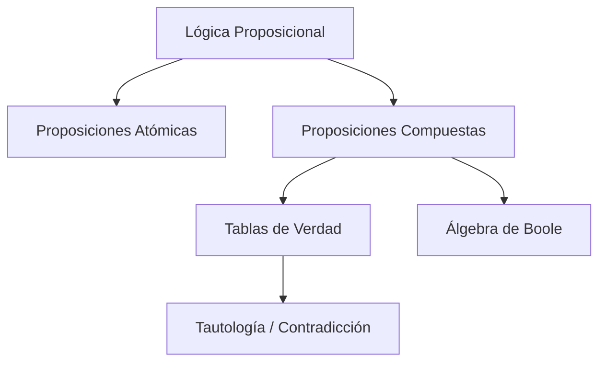
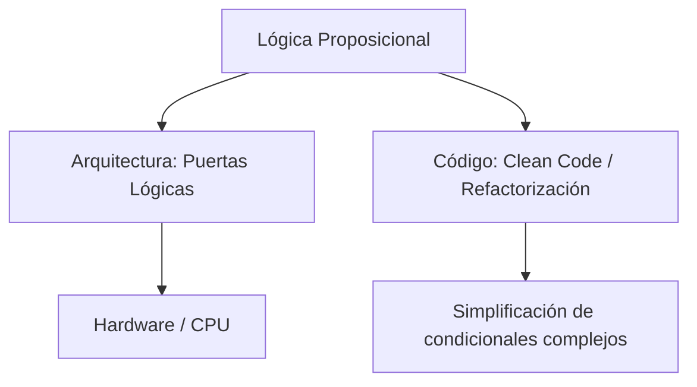

---
aliases:
  - Lógica Simbólica
  - Cálculo Proposicional
  - Cálculo de Enunciados
tags:
  - logica_booleana
  - fundamentos_matematicos
  - demostraciones
  - matemáticas
  - cs-theory
created: 2026-02-19 08:54
modified: 2026-02-24 12:11
rating: 5
nivel: 2
fuentes:
  - Discrete Mathematics and Its Applications (Rosen)
  - Mathematical Logic for Computer Science (Mordechai Ben-Ari)
estado: estudiando
---

# 02. Lógica Proposicional

> [!abstract]+ Resumen
> **Idea Principal**: La Lógica Proposicional es la rama de la lógica que estudia las proposiciones y las formas en que se combinan mediante conectores, evaluando su valor de verdad.
> **Contexto**: Para un ING. Software, es la base de las **estructuras de control** (if/else), el diseño de circuitos lógicos, la optimización de consultas en bases de datos y la verificación de algoritmos.

## 🎯 **Concepto Clave**
**Definición**: Se ocupa de sentencias declarativas (proposiciones) que pueden ser verdaderas o falsas, pero no ambas. A diferencia de la lógica de predicados, aquí no analizamos el "sujeto", sino la frase como un bloque atómico.

> [!tip] TL;DR para Humanos:
> Es el sistema de reglas para decidir si una frase compuesta es verdad o mentira basándose solo en sus partes. Es como el "álgebra de las palabras".

###### **Notación Polinómica**
Es el lenguaje formal que utilizamos en lógica para representar afirmaciones y sus relaciones sin las ambigüedades del lenguaje cotidiano. Para "escribir" en lógica proposicional, necesitamos dos elementos principales:

1. **Variables Proposicionales**
Representan una afirmación completa que puede ser verdadera (V) o falsa (F). Por convención usamos letras minúsculas a partir de la *p*:
- *p*: Está lloviendo
- *q*: Llevo paraguas

2. **Conectores Lógicos**
Son los símbolos que unen las proposiciones para formar frases más complejas.

| Conector | Nombre | Símbolo |
| :-: | :-: | :-: |
| Negación | No | ¬ |
| Conjunción | Y | ∧ |
| Disyunción | O | ∨ |
| Condicional | Si... Entonces | → |
| Bicondicional | Si y solo si | ↔ |

##### 💻 **Implementación / Ejemplo**

```markdown

##### Ejemplo genérico (Pseudocódigo)
SI (usuario_autenticado AND token_valido) ENTONCES
    PERMITIR_ACCESO
SINO
    RECHAZAR_ACCESO
```


##### **Fórmula/Key Metric**: `Leyes de De Morgan`
$$
\neg(p \land q) \iff (\neg p \lor \neg q)
$$
$$
\neg(p \lor q) \iff (\neg p \land \neg q)
$$

## 🔍 **Mapa del Concepto**


## 🔍 **¿Por qué importa?**


## 📋 **Propiedades Clave**
| Aspecto       | Detalle              |
| ------------- | -------------------- |
| Complejidad   | Media                |
| Uso frecuente | Esencial             |
| Complejidad (Big-O)| O(2^n) para Tablas de Verdad |
| Prerequisitos | [[02. Binario y Lógica]] |
| MOC Padre     | [[10_MOC Matemáticas]] |

## ⚠️ Errores Comunes
- **Confundir el Condicional ($p \to q$)**: Pensar que si $p$ es falso, la frase es falsa. En lógica, si el antecedente es falso, la implicación es **vacuamente verdadera**.
- **Ambigüedad del "O"**: En lenguaje natural usamos "o" como excluyente (o sopa o ensalada), pero en lógica $\lor$ es **incluyente** (pueden ser ambos).

## 💡 Intuición
Imagina un circuito eléctrico. Los conectores son interruptores. Para que la bombilla se encienda (Verdadero), la corriente debe poder pasar siguiendo las reglas de los interruptores (AND en serie, OR en paralelo).

## 🔗 **Conexiones**
- **Entrada**: [[01. Matemática Discreta]] → Esta nota
- **Salida**: Esta nota → [[07. Matemática para Algoritmos]]
- **Hermanos**: [[02. Binario y Lógica]], [[03. Teoría de Conjuntos]]

## 🧩 Pregunta típica de entrevista
- "¿Cómo simplificarías una condición `if (!(A && !B))` para que sea más legible?" (Respuesta: Aplicando De Morgan: `!A || B`).

## 🛠 Laboratorio (Active Recall)
[ ] Explicación Feynman: ¿Puedo explicar la tabla de verdad del condicional sin dudar?
[ ] Flashcard: ¿Qué es una contingencia?
[ ] Prueba de Código: Simplificar un bloque `if-else` complejo en [[Laboratorio]].

## 🚀 **Siguiente Acción**
- **Leer**: Rosen, Discrete Mathematics, Cap 1.1 - 1.3.
- **Hacer**: Ejercicio de transformar lenguaje natural a fórmulas simbólicas.

## 📚 **Fuentes**
1. Rosen, K. H. (2012). *Discrete Mathematics and Its Applications*. McGraw-Hill.
2. Mordechai Ben-Ari. (2012). *Mathematical Logic for Computer Science*. Springer.

## Cosas que escribo por mi parte para ordenarlas a Futuro
Hacer las tablas de la Verdad tienen una Complejidad Temporal en O(2ⁿ) según la notación Big-O.

### Leyes de Boole (Simplificación)

1. **Negación de la Conjunción (Y)**
$$\neg(p \land q) = \neg p \vee \neg q$$

2. **Negación de la Disyunción (O)**
$$\neg(p \vee q) = \neg p \land \neg q$$

3. **Absorción**
- *Estandar*: **Conjunción sobre Disyunción**
$$p \land (p \vee q) = p$$

- *Estandar*: **Disyunción sobre Conjunción**
$$p \vee (p \land q) = p$$

